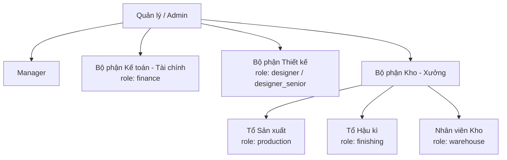
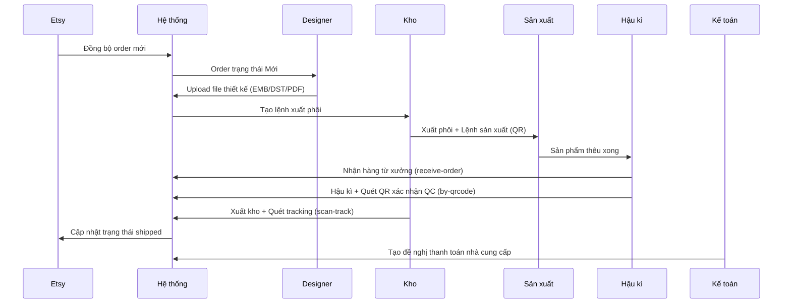

# Cơ cấu Tổ chức — StreamHub

## Sơ đồ tổ chức

---

## Mô tả từng bộ phận

### Admin / Quản lý
- Truy cập toàn bộ hệ thống
- Cấu hình hệ thống, phân quyền người dùng
- Xem báo cáo tổng hợp

### Manager
- Theo dõi tiến độ đơn hàng (dashboard)
- Phê duyệt đề nghị thanh toán
- Xem báo cáo vận hành

### Bộ phận Thiết kế (Designer / Designer Senior)

**Designer** (`role: designer`):
- Nhận order ở trạng thái **Mới**, thực hiện thiết kế
- Upload file thiết kế: `.emb`, `.dst`, `.pdf`
- Chuyển order sang **Chờ Duyệt Design** (`pending_review`)

**Designer Senior** (`role: designer_senior`):
- Làm mọi việc của Designer
- Thêm quyền **duyệt design** (`pending_review → designed`): xem xét file thiết kế của Designer, duyệt hoặc trả lại
- Phụ trách đào tạo và hỗ trợ kỹ thuật cho Designer

### Bộ phận Kế toán - Tài chính (Finance)
- Tạo và quản lý **Đề nghị thanh toán**
- Xác nhận và theo dõi trạng thái thanh toán nhà cung cấp
- Xem báo cáo tài chính theo kỳ

### Bộ phận Kho - Xưởng

#### Tổ Sản xuất (Production Staff)
- Nhận **Lệnh sản xuất** từ hệ thống (stock/order)
- Cập nhật trạng thái sản xuất: **Chưa sản xuất → Đang sản xuất → Sản xuất xong**
- Gắn file EMB/DST vào lệnh sản xuất

#### Tổ Hậu kì (Finishing Staff) — role: `finishing`
- Nhận hàng từ xưởng thêu (`/receive-order`) — scan Order ID, xác nhận số lượng nhận
- Thực hiện hậu kì (`/export-hk`): cắt chỉ → kiểm tra chất lượng → ủi → đóng gói
- Quét QR code xác nhận QC đạt (`/by-qrcode`) — bắt buộc trước khi xuất kho
- Nếu QC fail: ghi note + set `order_items.status = qc_failed`, chuyển lại Production hoặc ghi lỗi
- Chuyển hàng đã QC sang khu vực xuất kho

#### Nhân viên Kho (Warehouse Staff) — role: `warehouse`
- Quản lý phôi (blank products): nhập kho (`/in-out`), tồn kho (`/inventory`), xuất kho (`/output-order`)
- Vận hành hệ thống QR code: tạo (`/gen-qrcode`), quét nhập/xuất
- Quản lý kệ hàng (`/shelf`)
- Theo dõi chỉ thêu (`/emb-thread`)
- Quét tracking số (`/scan-track`) — sau khi Finishing chuyển hàng ra
- Tạo và quản lý **Đề nghị thanh toán**

---

## Luồng tương tác giữa các bộ phận

