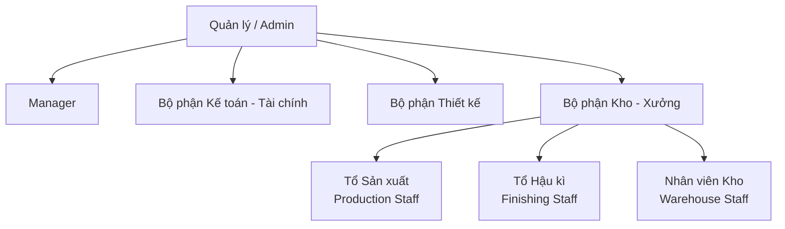
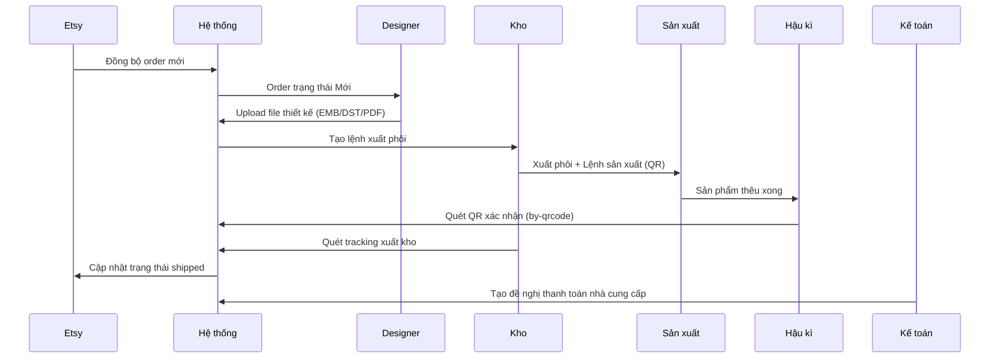

# Cơ cấu Tổ chức — StreamHub

## Sơ đồ tổ chức

---

## Mô tả từng bộ phận

### Admin / Quản lý
- Truy cập toàn bộ hệ thống
- Cấu hình hệ thống, phân quyền người dùng
- Xem báo cáo tổng hợp

### Manager
- Theo dõi tiến độ đơn hàng (dashboard)
- Phê duyệt đề nghị thanh toán
- Xem báo cáo vận hành

### Bộ phận Thiết kế (Designer)
- Nhận order ở trạng thái **Mới**, thực hiện thiết kế
- Upload file thiết kế: `.emb`, `.dst`, `.pdf`
- Chuyển trạng thái order sang **Đã Design**

### Bộ phận Kế toán - Tài chính (Finance)
- Tạo và quản lý **Đề nghị thanh toán**
- Xác nhận và theo dõi trạng thái thanh toán nhà cung cấp
- Xem báo cáo tài chính theo kỳ

### Bộ phận Kho - Xưởng

#### Tổ Sản xuất (Production Staff)
- Nhận **Lệnh sản xuất** từ hệ thống (stock/order)
- Cập nhật trạng thái sản xuất: **Chưa sản xuất → Đang sản xuất → Sản xuất xong**
- Gắn file EMB/DST vào lệnh sản xuất

#### Tổ Hậu kì (Finishing Staff)
- Nhận sản phẩm sau thêu từ Tổ Sản xuất
- Thực hiện: cắt chỉ → kiểm tra chất lượng → ủi → đóng gói
- Quét QR code xác nhận hoàn thành (`/by-qrcode`)
- Chuyển hàng sang bộ phận xuất kho

#### Nhân viên Kho (Warehouse Staff)
- Quản lý phôi (blank products): nhập kho (`/in-out`), tồn kho (`/inventory`), xuất kho (`/output-order`)
- Vận hành hệ thống QR code: tạo (`/gen-qrcode`), quét, xác nhận
- Quản lý kệ hàng (`/shelf`)
- Theo dõi chỉ thêu (`/emb-thread`)
- Quét tracking số (`/scan-track`)

---

## Luồng tương tác giữa các bộ phận

