# Luồng Công việc (Workflow)

## 1. Vòng đời Order (Order Lifecycle)

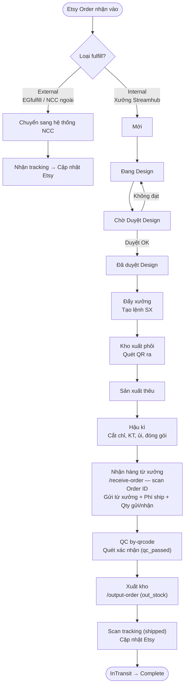

### Trạng thái Order

| Trạng thái | `status` | Mô tả | Người phụ trách |
|------------|----------|-------|----------------|
| Mới | `new` | Order vừa nhận / tạo | Hệ thống tự tạo |
| Need Confirm | `need_confirm` | Thiếu thông tin, cần xác nhận | Manager |
| Đang Design | `designing` | Đã giao cho Designer | Designer |
| Chờ Duyệt Design | `pending_review` | File đã upload, chờ QA duyệt | Designer Senior / Manager |
| Đã duyệt design | `designed` | Design được duyệt, sẵn sàng SX | Manager |
| Chưa sản xuất | `in_production` | Đã đẩy sang xưởng, chờ làm | Production Staff |
| Đang Sản Xuất | `producing` | Đang thêu | Production Staff |
| Làm lại | `redo` | Yêu cầu làm lại | Production Staff |
| Xưởng trả lại | `factory_return` | Xưởng trả về có vấn đề | Production Staff / Warehouse |
| Sửa lại | `fixing` | Đang xử lý sửa chữa | Production Staff |
| Sản xuất xong | `produced` | Thêu xong, chuyển hậu kì | Production Staff |
| Đang hậu kỳ | `in_finishing` | Đang hậu kỳ sau khi nhận hàng từ xưởng | Finishing Staff |
| QC đạt | `qc_passed` | Quét QR `/by-qrcode` xác nhận chất lượng đạt | Finishing Staff |
| Đã xuất kho | `out_stock` | Hàng đã xuất, có tracking | Warehouse Staff |
| Shipped | `shipped` | Tracking đã cập nhật lên Etsy | Hệ thống tự động |
| InTransit | `in_transit` | Carrier đã scan nhận hàng | Carrier webhook (tự động) |
| Complete | `complete` | Đơn hoàn tất, ghi `completed_at` | Hệ thống / Manager |
| Đã hủy | `cancelled` | Đơn bị hủy (buyer request / hết hàng / Etsy cancel) | Manager / Admin |

### Luồng Hủy Đơn (`cancelled`)

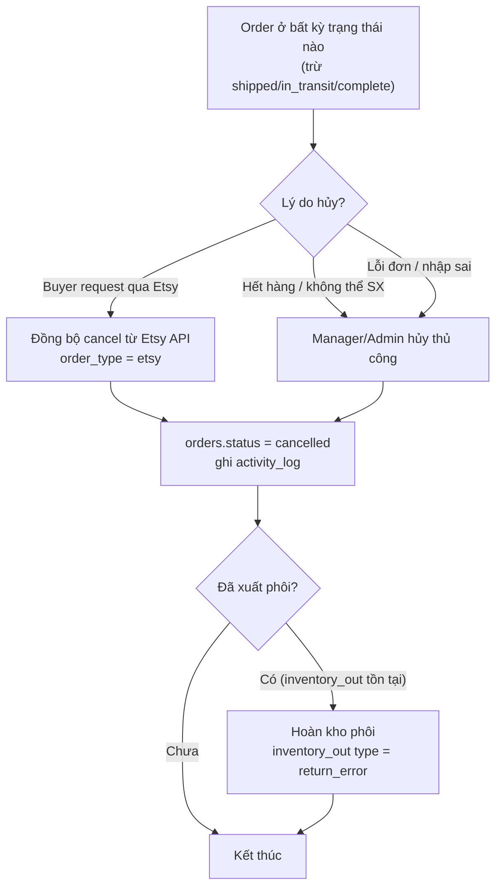

**Quy tắc hủy đơn:**
- Có thể hủy khi status `IN (new, need_confirm, designing, pending_review, designed, in_production, producing, redo, fixing, factory_return, produced, in_finishing, qc_passed)`
- **Không được hủy** khi đã `out_stock`, `shipped`, `in_transit`, `complete` (hàng đã bàn giao carrier)
- Đơn Etsy bị hủy trên Etsy → webhook/sync tự động cập nhật về `cancelled`
- Khi hủy đơn đã có `inventory_out`, phải tạo bản ghi `inventory_out` loại `return_error` để hoàn kho
- Đơn đã gộp (`merged_order_id != NULL`): xem mục 3b

---

## 1b. Luồng External Fulfill

Áp dụng khi `orders.fulfill_type = 'external'` (đối tác EGfulfill, NCC ngoài).

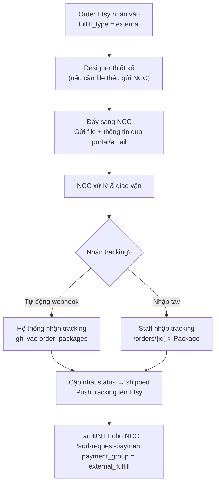

**Điểm khác biệt so với Internal:**
- Bỏ qua toàn bộ bước kho nội bộ (`inventory_lots`, `inventory_out`, QR scan)
- Bỏ qua bước sản xuất (`in_production → producing → produced`)
- Không dùng `/auto-label` (NCC tự tạo label)
- Tracking có thể nhận qua webhook (nếu NCC hỗ trợ) hoặc nhập tay
- Bắt buộc tạo ĐNTT để thanh toán chi phí fulfill

---

## 2. Luồng Quản lý Kho (Inventory Flow)

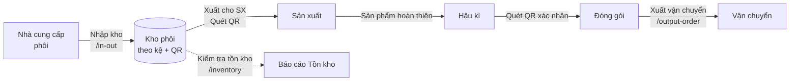

### Quy trình Nhập kho Phôi (`/in-out`)

1. Chọn kệ đích (kệ số 1, 2, 3, 51, …)
2. Quét QR code phôi bằng camera
3. Hệ thống ghi nhận nhập kho, cập nhật số lượng trên kệ
4. In phiếu nhập kho

### Quy trình Xuất kho (`/output-order`)

1. Căn cứ lệnh sản xuất
2. Quét QR code phôi cần xuất
3. Hệ thống trừ tồn kho, ghi lịch sử xuất
4. Chuyển phôi sang tổ sản xuất

---

## 3. Luồng Đề nghị Thanh toán

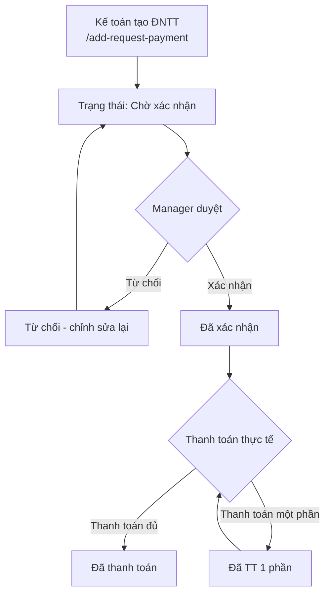

### Phân loại Đề nghị Thanh toán

| Phân loại | `payment_group` | Mô tả |
|-----------|----------------|-------|
| Fulfill ngoài | `external_fulfill` | Thanh toán cho đối tác fulfill (EGfulfill, ...) |
| Phôi sản phẩm | `material` | Mua nguyên liệu thô (blank products) |
| Nguyên vật liệu thêu | `thread` | Chỉ, phụ kiện thêu |
| Phí vận chuyển | `shipping` | Phí ship nội địa / quốc tế (VD: phí ship Việt–Trung) |
| Design - File thêu | `design` | Chi phí thiết kế / file thêu từ bên ngoài |
| Khác | `other` | Các chi phí phát sinh khác (Mua ngoài, Ship lẻ, ...) |

---

## 3b. Luồng Gộp Đơn (`merged_order_id`)

Dùng khi nhiều đơn từ cùng khách, ship chung một kiện để tiết kiệm phí vận chuyển.

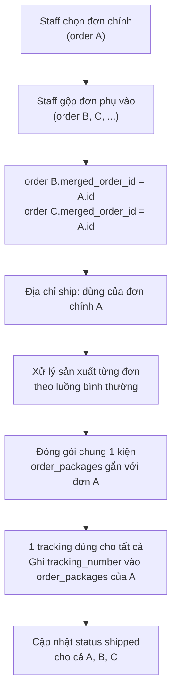

**Quy tắc:**
- Chỉ gộp khi tất cả đơn `fulfilled_type = internal`, cùng địa chỉ giao
- Đơn phụ (B, C) vẫn xử lý design và sản xuất riêng
- Tracking chỉ tạo 1 lần trên đơn chính, đơn phụ inherit tracking
- Không gộp đơn external fulfill với internal

**Xử lý khi đơn con bị hủy sau khi đã gộp:**
- Đơn phụ (B hoặc C) bị hủy → set `orders.status = cancelled` cho đơn phụ đó, xóa/bỏ qua `merged_order_id` của đơn phụ
- Tracking đã tạo trên đơn chính (A) vẫn dùng để ship phần còn lại
- Nếu **đơn chính (A) bị hủy**: phải ungroupp — chuyển một đơn phụ lên làm đơn chính mới (staff thực hiện thủ công), tạo package + tracking mới
- Không tự động ungroupp — cần xác nhận của Manager/Admin

---

## 3c. Luồng Xưởng Trả Lại (`factory_return`)

Khi xưởng thêu không thể thực hiện hoặc trả lại sản phẩm sau khi nhận lệnh SX.

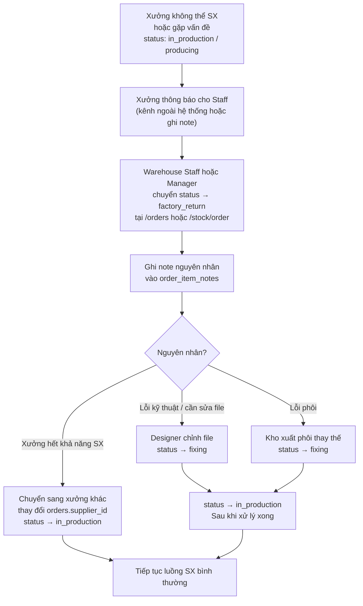

**Người phụ trách:** Warehouse Staff hoặc Manager chuyển trạng thái `factory_return`. Production Staff ghi nhận nguyên nhân.

---

## 4. Luồng QR Code (Vòng đời QR)

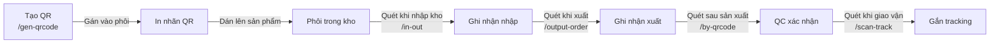

---

## 5. Luồng Đơn Lỗi (`/errors`)

Đơn lỗi phát sinh khi order_item bị phát hiện lỗi trong quá trình sản xuất hoặc QC.

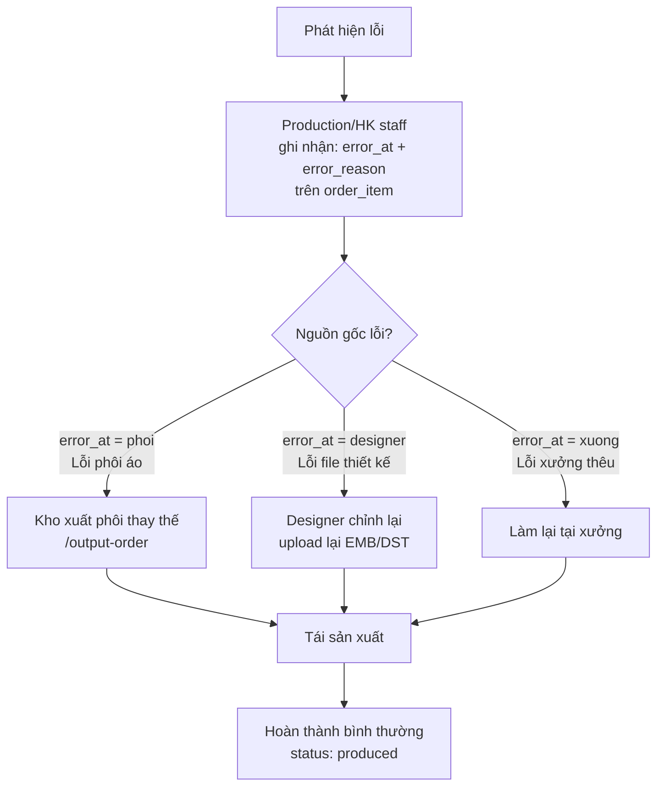

| `error_at` | Ý nghĩa | Xử lý |
|---|---|---|
| `xuong` | Lỗi do xưởng thêu | Xưởng chịu trách nhiệm làm lại |
| `designer` | Lỗi file thiết kế | Designer upload lại file |
| `phoi` | Lỗi phôi nguyên liệu | Kho xuất phôi thay thế, ghi vào `inventory_out` |

---

## 6. Luồng Orders Xưởng & Hậu kỳ

### 6.1 Orders Xưởng (`/stock/order`)

Sau khi Manager đẩy xưởng, Production Staff xem lệnh sản xuất và cập nhật tiến độ từng order_item.

**Filters trang `/stock/order`:**
- Date, Status, Order ID, SKU
- Loại sản phẩm (`product_type_id`)
- Xưởng (`supplier_id`)
- Checkbox: Sản xuất xong | Làm gấp (`labels LIKE '%lam_gap%'`)

**Columns hiển thị:** OrderID, SKU, QTY, Image, Variants, Ngày order, Ngày đẩy xưởng (`pushed_at`), Country, Trạng thái

**Mỗi order_item hiển thị:**
- Ảnh thiết kế + variants + personalization
- Item Note log (từ `order_item_notes` — có timestamp + ảnh đính kèm)
- Note đỏ: lý do làm lại / lỗi thiết kế
- Badge "Làm gấp" nếu label có `lam_gap`
- Button **Lệnh sản xuất** — in phiếu giao việc cho xưởng
- File nhanh: **EMB / DST / pdf** — download trực tiếp

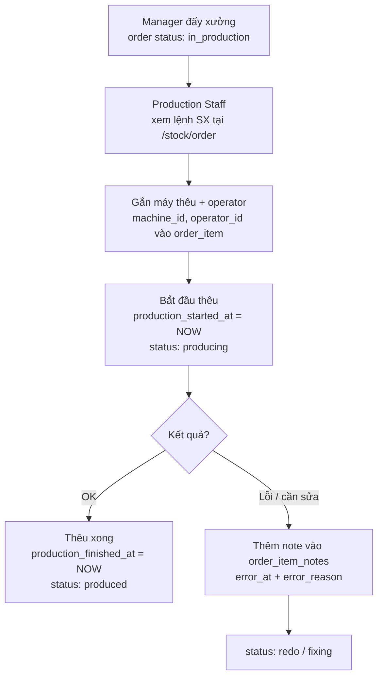

### 6.2 Receive Orders & Hậu kỳ (`/receive-order`, `/export-hk`)

Luồng hậu kì theo thứ tự: nhận hàng → hoàn thiện + QC → đóng gói xác nhận QR → xuất kho.

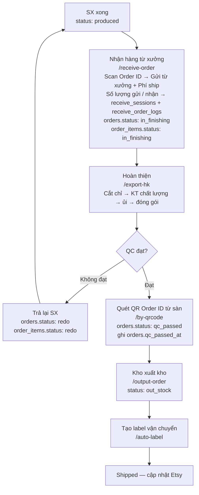

> **Phân biệt `/export-hk` và `/by-qrcode`:**
> - `/export-hk`: Trang làm việc của Tổ Hậu kì — ghi nhận từng bước hoàn thiện (cắt chỉ, ủi, đóng gói), xác nhận QC nội bộ
> - `/by-qrcode`: Scan **QR Order ID từ sàn** (QR do Etsy/marketplace đính kèm sản phẩm, chứa order code) để hệ thống ghi nhận `qc_passed` chính thức — bắt buộc trước khi xuất kho. Khác với QR phôi (`inventory_items.qrcode`) chỉ dùng cho nhập/xuất kho.

---

## 7. Luồng Auto Label (`/auto-label`)

Tạo shipping label tự động qua API carrier, thay thế việc tạo tay trên Etsy.

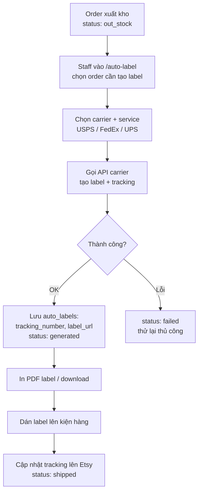

| `status` | Ý nghĩa |
|---|---|
| `pending` | Chờ tạo label |
| `generated` | Label đã tạo, chưa in |
| `printed` | Đã in và dán |
| `failed` | Tạo label thất bại |

---

## 8. Dashboard Kho Xưởng (`/dashboard-supplier`)

Dashboard tổng hợp hiệu suất sản xuất theo kỳ (lọc theo ngày).

### 8.1 Trạng thái máy thêu (real-time)

Hiển thị toàn bộ máy thêu dưới dạng grid icon, màu sắc theo `machines.status`:

| Màu | `status` | Ý nghĩa |
|---|---|---|
| Xanh lá | `idle` | Đang trống, chờ việc |
| Vàng | `active` | Đang sản xuất |
| Đỏ | `error` / `maintenance` | Đang lỗi hoặc bảo trì |

Số % trên mỗi máy = tỷ lệ hoàn thành của các order_item giao cho máy đó trong kỳ:
```
% = (count order_items WHERE machine_id = X AND status = 'done') 
  / (count order_items WHERE machine_id = X) × 100
```

### 8.2 Biểu đồ theo máy

Bar chart: số lượng `order_items` hoàn thành (`status = done`) group by `machine_id` trong kỳ.

Nguồn dữ liệu: `order_items` JOIN `machines`, lọc theo `production_finished_at` trong range ngày.

### 8.3 Biểu đồ & bảng thống kê theo kỹ thuật viên

Bar chart + bảng thống kê group by `operator_id`:

| Cột | Công thức |
|---|---|
| Tổng sản phẩm | `COUNT(order_items)` WHERE operator_id = X trong kỳ |
| Đang sản xuất | `COUNT` WHERE status = `in_progress` (= `order_items.status = 'in_progress'`) |
| Sản xuất xong | `COUNT` WHERE status = `done` (= `order_items.status = 'done'`) |
| Lỗi (%) | `COUNT` WHERE `error_reason IS NOT NULL` / Tổng × 100 |
| AVG Time | `AVG(production_finished_at - production_started_at)` tính bằng phút |

> Yêu cầu: `order_items` phải có `operator_id`, `production_started_at`, `production_finished_at`.

---

## 9. Cảnh báo Vận hành (Operational Alerts)

Hệ thống hiển thị cảnh báo nổi bật trên các trang:

| Cảnh báo | Ngưỡng | Vị trí hiển thị |
|----------|--------|-----------------|
| Order quá N ngày chưa Design | 2 ngày | Trang Orders |
| Order quá N ngày chưa Sản xuất xong | 3 ngày | Trang Orders |
| Order quá N ngày chưa Ship | 4 ngày | Trang Orders |
| Order QC đạt quá 24h chưa ship | 24 tiếng | Trang Orders |
| Order QC đạt quá N ngày chưa InTransit | 5 ngày | Trang Orders |
| Order quá 1 ngày chưa SX xong | 1 ngày | Trang Stock/Order |
| Đề nghị TT sắp đến hạn | < 3 ngày | Dashboard thanh toán |
| Đề nghị TT quá hạn | Quá ngày | Dashboard thanh toán (badge đỏ) |

---

## 10. Cơ chế Cập nhật `in_transit` và `complete`

### Chuyển `shipped → in_transit`

| Phương thức | Điều kiện | Ghi chú |
|---|---|---|
| **Carrier webhook** | Carrier hỗ trợ webhook (USPS, FedEx, UPS) | Tự động khi carrier scan nhận hàng |
| **Etsy API polling** | Etsy nhận được update từ carrier và phản hồi qua API | Hệ thống poll định kỳ (khuyến nghị mỗi 6h) |
| **Nhập tay** | Carrier không hỗ trợ webhook | Warehouse Staff cập nhật thủ công tại trang Orders |

Ưu tiên: Webhook > Etsy poll > Thủ công.

### Chuyển `in_transit → complete`

Trigger khi **một trong hai** điều kiện:
1. Carrier xác nhận "Delivered" qua webhook / Etsy API
2. Manager/Admin đánh dấu hoàn tất thủ công (sau khi xác nhận với khách)

Khi `complete`: ghi `orders.completed_at = NOW()`.
