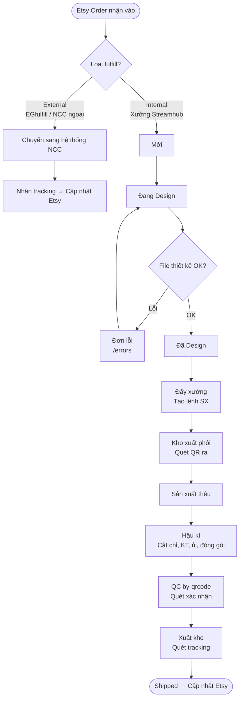
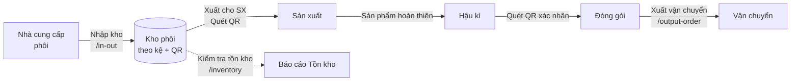
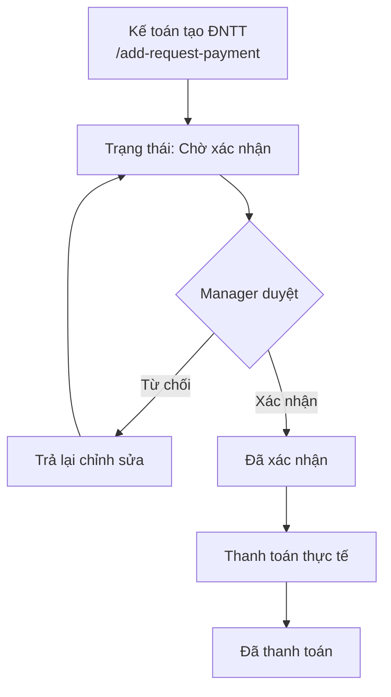
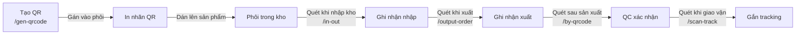

# Luồng Công việc (Workflow)

## 1. Vòng đời Order (Order Lifecycle)

### Trạng thái Order

| Trạng thái | Mô tả | Người phụ trách |
|------------|-------|----------------|
| Mới | Order vừa nhận từ Etsy | Hệ thống tự tạo |
| Đang Design | Đã giao cho Designer | Designer |
| Đã Design | File thiết kế đã upload | Designer |
| Chưa sản xuất | Đã đẩy sang xưởng, chờ làm | Production Staff |
| Đang sản xuất | Đang thêu | Production Staff |
| Sản xuất xong | Thêu xong, chuyển hậu kì | Production Staff |
| Đã xuất kho | Hàng đã xuất, có tracking | Warehouse Staff |
| Shipped | Tracking đã cập nhật Etsy | Hệ thống tự động |

---

## 2. Luồng Quản lý Kho (Inventory Flow)

### Quy trình Nhập kho Phôi (`/in-out`)

1. Chọn kệ đích (kệ số 1, 2, 3, 51, …)
2. Quét QR code phôi bằng camera
3. Hệ thống ghi nhận nhập kho, cập nhật số lượng trên kệ
4. In phiếu nhập kho

### Quy trình Xuất kho (`/output-order`)

1. Căn cứ lệnh sản xuất
2. Quét QR code phôi cần xuất
3. Hệ thống trừ tồn kho, ghi lịch sử xuất
4. Chuyển phôi sang tổ sản xuất

---

## 3. Luồng Đề nghị Thanh toán

### Phân loại Đề nghị Thanh toán

| Phân loại | Mô tả |
|-----------|-------|
| Fulfill ngoài | Thanh toán cho đối tác fulfill (EGfulfill, ...) |
| Phôi sản phẩm | Mua nguyên liệu thô (blank products) |
| Nguyên vật liệu thêu | Chỉ, phụ kiện thêu |
| Khác | Các chi phí phát sinh khác |

---

## 4. Luồng QR Code (Vòng đời QR)

---

## 5. Cảnh báo Vận hành (Operational Alerts)

Hệ thống hiển thị cảnh báo nổi bật trên các trang:

| Cảnh báo | Ngưỡng | Vị trí hiển thị |
|----------|--------|-----------------|
| Order quá N ngày chưa Design | 2 ngày | Trang Orders |
| Order quá N ngày chưa Sản xuất xong | 3 ngày | Trang Orders |
| Order quá 1 ngày chưa SX xong | 1 ngày | Trang Stock/Order |
| Đề nghị TT sắp đến hạn | < 3 ngày | Dashboard thanh toán |
| Đề nghị TT quá hạn | Quá ngày | Dashboard thanh toán (badge đỏ) |
