# Thiết kế Cơ sở Dữ liệu

## ERD Tổng quan

```mermaid
erDiagram
    SHOPS ||--o{ ORDERS : "có"
    USERS ||--o{ ORDERS : "designer"
    USERS ||--o{ ORDERS : "cs"
    SUPPLIERS ||--o{ ORDERS : "fulfill"
    ORDERS ||--|{ ORDER_ITEMS : "chứa"
    ORDERS ||--o{ ORDER_PACKAGES : "kiện hàng"
    ORDERS ||--o{ ORDERS : "gộp đơn"
    PRODUCT_TYPES ||--o{ ORDER_ITEMS : "loại SP"
    PRODUCT_TYPES ||--o{ PRODUCT_TYPES : "parent"
    PRODUCT_TYPES ||--o{ PRODUCT_TYPE_VARIANTS : "có variant"
    PRODUCT_TYPE_VARIANTS ||--|{ PRODUCT_TYPE_VARIANT_VALUES : "các giá trị"
    USERS ||--o{ ORDER_ITEMS : "listing by"

    SUPPLIERS ||--o{ INVENTORY_LOTS : "cung cấp phôi"
    PRODUCT_TYPES ||--o{ INVENTORY_LOTS : "phân loại"
    SHELVES ||--o{ INVENTORY_LOTS : "chứa"
    INVENTORY_LOTS ||--o{ INVENTORY_IN : "ghi nhập"
    INVENTORY_LOTS ||--o{ INVENTORY_OUT : "ghi xuất"
    ORDER_ITEMS ||--o{ INVENTORY_OUT : "xuất theo item"
    ORDER_ITEMS }o--|| INVENTORY_LOTS : "lot phôi dùng"
    ORDER_ITEMS ||--o{ ORDER_ITEM_NOTES : "ghi chú"
    PAYMENT_REQUESTS ||--o{ PAYMENT_REQUEST_FILES : "file phụ"
    DESIGN_LEVELS ||--o{ PRODUCT_TYPES : "cấp độ"

    SUPPLIERS ||--o{ THREAD_LOTS : "cung cấp chỉ"
    THREAD_LOTS ||--o{ THREAD_OUT : "ghi xuất chỉ"
    ORDER_ITEMS ||--o{ THREAD_OUT : "dùng chỉ"

    ORDERS ||--o{ RECEIVE_ORDER_LOGS : "nhận từ xưởng"
    SUPPLIERS ||--o{ RECEIVE_ORDER_LOGS : "gửi hàng"

    PRODUCT_TYPES ||--o{ PRODUCTS : "catalog"
    SHOPS ||--o{ PRODUCTS : "bán"
    PRODUCT_TYPES ||--o{ ORDER_EXAMPLES : "mẫu"
    ORDERS ||--o{ AUTO_LABELS : "label"

    SUPPLIERS ||--o{ PAYMENT_REQUESTS : "thanh toán"
    USERS ||--o{ PAYMENT_REQUESTS : "tạo"
    PAYMENT_REQUESTS ||--|{ PAYMENT_REQUEST_ITEMS : "chứa"
    PAYMENT_REQUESTS ||--|{ PAYMENT_REQUEST_APPROVERS : "người duyệt"
    USERS ||--o{ PAYMENT_REQUEST_APPROVERS : "duyệt"
    USERS ||--o{ ACTIVITY_LOGS : "ghi log"

    MACHINES ||--o{ ORDER_ITEMS : "thêu"

    USERS }o--|| ROLES : "có role"
    SHOPS }o--|| USERS : "quản lý"
```

---

## Định nghĩa Bảng

### `shops` — Cửa hàng Etsy

| Cột | Kiểu | Mô tả |
|-----|------|-------|
| `id` | INT PK | |
| `name` | VARCHAR(100) | Tên shop |
| `order_prefix` | VARCHAR(5) | Prefix cho mã đơn (VD: `ME`, `MA`) — dùng khi sinh `orders.order_code` |
| `etsy_shop_id` | VARCHAR(50) | ID trên Etsy |
| `etsy_api_key` | VARCHAR(255) | API key (encrypted) |
| `sync_interval` | INT | Tần suất đồng bộ order từ Etsy (phút, VD: 5–15) |
| `default_designer_id` | INT FK → users | Designer mặc định nhận order của shop này (nullable) |
| `sender_name` | VARCHAR(100) | Tên người gửi hiển thị trên nhãn vận chuyển (VD: "StreamHub Shop") |
| `sender_address` | TEXT | Địa chỉ gửi hàng — dùng cho auto-label, JSON hoặc text tự do |
| `is_active` | TINYINT | 1 = hoạt động |

### `users` — Người dùng hệ thống

| Cột | Kiểu | Mô tả |
|-----|------|-------|
| `id` | INT PK | |
| `name` | VARCHAR(100) | Tên hiển thị |
| `email` | VARCHAR(150) | Email đăng nhập |
| `password_hash` | VARCHAR(255) | Mật khẩu (bcrypt) |
| `role_id` | INT FK → roles | Vai trò |
| `shop_id` | INT FK → shops | Shop phụ trách (nullable) |
| `avatar` | VARCHAR(255) | Đường dẫn ảnh đại diện |
| `is_active` | TINYINT | |
| `created_at` | DATETIME | |

### `roles` — Vai trò phân quyền

| Cột | Kiểu | Mô tả |
|-----|------|-------|
| `id` | INT PK | |
| `name` | VARCHAR(50) | admin, manager, designer, warehouse, production, finance |
| `permissions` | JSON | Danh sách quyền |

### `orders` — Đơn hàng

| Cột | Kiểu | Mô tả |
|-----|------|-------|
| `id` | INT PK | |
| `order_code` | VARCHAR(30) UNIQUE | Mã đơn nội bộ theo format `{PREFIX}{YYYYMMDDHHmmss}` — VD: `ME20260604144945`. Prefix lấy từ `shops.order_prefix` (ME = Media E, MA = Media A, ...), phần sau là datetime tại thời điểm tạo (không phải sequence) |
| `order_type` | ENUM | `etsy` = đồng bộ từ Etsy, `internal` = tạo nội bộ |
| `etsy_order_id` | VARCHAR(50) | ID đơn hàng Etsy (NULL nếu đơn nội bộ) |
| `shop_id` | INT FK → shops | |
| `listing_name` | VARCHAR(255) | Tên listing trên Etsy |
| `status` | ENUM | new, need_confirm, designing, pending_review, designed, in_production, producing, redo, fixing, factory_return, produced, in_finishing, **qc_passed**, out_stock, shipped, in_transit, complete, **cancelled** |
| `qc_passed_at` | DATETIME | Thời điểm order đạt `qc_passed` — dùng cho alert "QC đạt quá 24h chưa ship" (nullable) |
| `design_assigned_at` | DATETIME | Thời điểm giao cho Designer (để tính SLA alert) |
| `designer_id` | INT FK → users | Designer phụ trách |
| `cs_id` | INT FK → users | CS phụ trách (nullable) |
| `supplier_id` | INT FK → suppliers | Xưởng / NCC fulfill |
| `fulfill_type` | ENUM | internal, external |
| `labels` | VARCHAR(255) | Tags dạng comma-separated: `ship_nhanh,lam_gap,fail_sku,...` — **⚠ Migration needed:** truy vấn dùng `LIKE '%lam_gap%'` không dùng được index, plan migrate sang bảng `order_labels (order_id, label)` khi volume > 200K orders |
| `is_dup` | TINYINT | Đơn trùng (Đơn Dup) |
| `is_digital` | TINYINT | Sản phẩm digital |
| `shop_note` | TEXT | Ghi chú nội bộ của shop ("Shop's Note" trên UI, VD: "đơn VN") — hiển thị nổi bật ở Order Detail |
| `streamer_note` | TEXT | Ghi chú cá nhân hóa từ khách (nội dung personalization, đọc từ Etsy) |
| `merged_order_id` | INT FK → orders | Order được gộp vào (nullable — Extra > Gộp đơn). **Constraint:** đơn có `merged_order_id IS NOT NULL` không được làm đơn chính — application phải validate, tránh chain gộp nhiều cấp |
| `ioss_number` | VARCHAR(50) | Mã IOSS khai báo hải quan EU (nullable) |
| `item_total` | DECIMAL(12,2) | Tổng giá niêm yết các item |
| `discount` | DECIMAL(12,2) | Giảm giá Etsy |
| `shipping_fee` | DECIMAL(12,2) | Phí ship thu từ khách |
| `delivery_fee` | DECIMAL(12,2) | Phí giao nội địa (thường 0) |
| `sales_tax` | DECIMAL(12,2) | Thuế bang Mỹ |
| `tax` | DECIMAL(12,2) | Thuế khác |
| `order_total` | DECIMAL(12,2) | Tổng thực nhận = item_total − discount + shipping_fee + delivery_fee + sales_tax + tax |
| `currency` | VARCHAR(3) | USD / VND |
| `receiver_name` | VARCHAR(150) | Tên người nhận |
| `address_line1` | VARCHAR(255) | Địa chỉ dòng 1 |
| `address_line2` | VARCHAR(255) | Địa chỉ dòng 2 (nullable) |
| `city` | VARCHAR(100) | Thành phố |
| `state` | VARCHAR(50) | Bang / Tỉnh |
| `zipcode` | VARCHAR(20) | Mã bưu chính |
| `country` | VARCHAR(100) | Quốc gia |
| `phone` | VARCHAR(30) | Số điện thoại (nullable) |
| `tracking_number` | VARCHAR(100) | **Legacy, deprecated** — chỉ giữ để tương thích, dùng `order_packages.tracking_number` cho multi-package |
| `created_at` | DATETIME | Ngày tạo (Etsy hoặc thủ công) |
| `pushed_at` | DATETIME | Ngày đẩy xưởng |
| `shipped_at` | DATETIME | |
| `completed_at` | DATETIME | Thời điểm order đạt `complete` — dùng cho SLA end-to-end và báo cáo vận hành (nullable) |
| `cancelled_at` | DATETIME | Thời điểm hủy đơn (nullable) |
| `updated_at` | DATETIME | Cập nhật tự động khi có thay đổi |

### `order_items` — Dòng sản phẩm trong đơn

| Cột | Kiểu | Mô tả |
|-----|------|-------|
| `id` | INT PK | |
| `order_id` | INT FK → orders | |
| `product_type_id` | INT FK → product_types | |
| `listing_user_id` | INT FK → users | Người phụ trách listing ("Listing by") |
| `sku` | VARCHAR(50) | Mã SKU |
| `qty` | INT | Số lượng |
| `price_sale` | DECIMAL(12,2) | Giá bán của item (USD) |
| `sup_cost` | DECIMAL(12,2) | Chi phí nguyên liệu từ NCC |
| `design_cost` | DECIMAL(12,2) | Chi phí thiết kế |
| `variants` | JSON | Size, Color, Style, ... |
| `personalization` | TEXT | Nội dung cá nhân hóa |
| `hscode` | VARCHAR(20) | Mã HS khai báo hải quan |
| `hs_name` | VARCHAR(100) | Tên hàng theo HS code |
| `hs_price` | DECIMAL(10,2) | Giá khai báo hải quan (USD) |
| `design_file_png` | VARCHAR(255) | **Deprecated** — dùng `order_item_design_files` thay thế |
| `design_file_emb` | VARCHAR(255) | **Deprecated** — dùng `order_item_design_files` thay thế |
| `design_file_dst` | VARCHAR(255) | **Deprecated** — dùng `order_item_design_files` thay thế |
| `design_file_pdf` | VARCHAR(255) | **Deprecated** — dùng `order_item_design_files` thay thế |
| `image_qc` | TINYINT | 1 = đã QC ảnh thiết kế (Extra > Image QC) |
| `machine_id` | INT FK → machines | Máy thêu phụ trách |
| `operator_id` | INT FK → users | Kỹ thuật viên vận hành máy |
| `production_started_at` | DATETIME | Thời điểm bắt đầu thêu (để tính AVG Time) |
| `production_finished_at` | DATETIME | Thời điểm hoàn thành thêu |
| `inventory_item_id` | INT FK → inventory_items | Chiếc phôi cụ thể được xuất dùng cho item này — nullable khi `qty > 1` (nhiều chiếc phôi). Khi `qty > 1`, tra cứu đầy đủ qua `inventory_out.order_item_id` |
| `production_note` | TEXT | Ghi chú sản xuất nhanh (deprecated — dùng `order_item_notes`) |
| `error_reason` | TEXT | Lý do lỗi (nếu item bị lỗi) |
| `error_at` | ENUM | xuong, designer, phoi — Nguồn gốc lỗi |
| `status` | ENUM | `pending` (chờ SX), `in_progress` (đang thêu), `done` (thêu xong), `in_finishing` (đang hậu kì — sau `/receive-order`), `redo` (cần làm lại), `qc_failed` (QC không đạt), `qc_passed` (QC đạt — item level) |
| `updated_at` | DATETIME | |

### `order_item_design_files` — File thiết kế theo vị trí

Mỗi `order_item` có thể có nhiều file thiết kế, phân theo vị trí thêu/in (Trước, Mặt sau, Left Chest...). Thay thế cho các cột flat `design_file_*` trên `order_items`.

Trên UI Order Detail hiển thị theo nhóm:
- **Trước:** [EMB] [DST] [PDF] [JPG]
- **Mặt sau:** [EMB] [DST] [PDF] [JPG]

| Cột | Kiểu | Mô tả |
|-----|------|-------|
| `id` | INT PK | |
| `order_item_id` | INT FK → order_items | |
| `position` | VARCHAR(50) | Vị trí: `Trước`, `Mặt sau`, `Left Chest`, ... — lấy từ `product_types.positions` JSON |
| `file_type` | ENUM | `emb`, `dst`, `pdf`, `jpg`, `png` |
| `file_path` | VARCHAR(255) | Đường dẫn file |
| `uploaded_by` | INT FK → users | |
| `is_active` | TINYINT | 1 = file đang được dùng. Khi Designer re-upload sau redo/fixing, set file cũ `is_active = 0`. Luôn lấy file có `is_active = 1` khi Production download |
| `created_at` | DATETIME | |

---

### `order_item_notes` — Ghi chú / Log sản xuất theo dòng sản phẩm

Mỗi dòng là một note được append vào order_item, có timestamp và có thể đính kèm ảnh. Thay thế `order_items.production_note`. Dùng cho:
- Ghi chú lỗi thiết kế có thời gian (VD: "15:27 05-06-2026 - Design Lỗi: đổi sang chỉ navy...")
- Lý do làm lại kèm ảnh minh họa (VD: "Lý do làm lại: lệch cổ" + ảnh lỗi)
- Ảnh tham chiếu từ khách hàng đính kèm item

| Cột | Kiểu | Mô tả |
|-----|------|-------|
| `id` | INT PK | |
| `order_item_id` | INT FK → order_items | |
| `note` | TEXT | Nội dung ghi chú |
| `images` | JSON | Danh sách URL ảnh đính kèm (nullable) |
| `created_by` | INT FK → users | Người tạo note |
| `created_at` | DATETIME | Timestamp hiển thị trên UI |

### `order_packages` — Gói hàng của đơn

Mỗi order có thể có nhiều package (kiện hàng). Tương ứng với section "Package" > "+ Add Package" trong Order Detail.

| Cột | Kiểu | Mô tả |
|-----|------|-------|
| `id` | INT PK | |
| `order_id` | INT FK → orders | |
| `tracking_number` | VARCHAR(100) | Mã tracking của kiện |
| `carrier` | VARCHAR(50) | Đơn vị vận chuyển |
| `weight` | DECIMAL(8,2) | Khối lượng (gram) |
| `note` | TEXT | Ghi chú kiện hàng |
| `created_at` | DATETIME | |

### `product_types` — Loại sản phẩm

| Cột | Kiểu | Mô tả |
|-----|------|-------|
| `id` | INT PK | |
| `name` | VARCHAR(100) | QuarterZip Sweater, Hoodie, ... |
| `short_name` | VARCHAR(20) | Mã nội bộ ngắn (VD: EQZ) |
| `parent_id` | INT FK → product_types | Danh mục cha self-referencing (VD: Embroidery) — nullable |
| `design_level_id` | INT FK → design_levels | Cấp độ thiết kế (Level 1, 2, ...) |
| `hscode` | VARCHAR(20) | Mã HS khai báo hải quan |
| `hs_name` | VARCHAR(255) | Tên hàng theo HS code |
| `hs_price` | DECIMAL(10,2) | Giá khai báo hải quan (USD) |
| `image` | VARCHAR(255) | Ảnh đại diện |
| `content` | LONGTEXT | Mô tả chi tiết (rich text HTML) |
| `data_map` | TEXT | Ánh xạ tên variant Etsy → hệ thống, mỗi dòng 1 cặp `key\|Value` |
| `positions` | JSON | Vị trí in/thêu (`["Front","Back","Left Chest",...]`) |
| `default_supplier_id` | INT FK → suppliers | NCC mặc định |
| `is_active` | TINYINT | |

### `product_type_variants` — Loại variant của sản phẩm

Định nghĩa các trục variant (Size, Color, Style, ...) cho từng loại sản phẩm.

| Cột | Kiểu | Mô tả |
|-----|------|-------|
| `id` | INT PK | |
| `product_type_id` | INT FK → product_types | |
| `name` | VARCHAR(50) | "Size", "Color", "Style" |
| `order` | INT | Thứ tự hiển thị |

### `product_type_variant_values` — Giá trị variant + thông số vật lý

Mỗi dòng là một giá trị cụ thể (S, M, Black, White...). Các trường kích thước/trọng lượng chỉ áp dụng cho variant Size, để NULL với các variant khác.

| Cột | Kiểu | Mô tả |
|-----|------|-------|
| `id` | INT PK | |
| `variant_id` | INT FK → product_type_variants | |
| `value` | VARCHAR(50) | "S", "M", "L", "Black", "White" |
| `length` | DECIMAL(8,2) | Chiều dài (cm) — nullable |
| `width` | DECIMAL(8,2) | Chiều rộng (cm) — nullable |
| `height` | DECIMAL(8,2) | Chiều cao (cm) — nullable |
| `weight` | DECIMAL(8,2) | Khối lượng (gram) — nullable |
| `weight_box` | DECIMAL(8,2) | Khối lượng hộp (gram) — nullable |

### `design_levels` — Cấp độ thiết kế

| Cột | Kiểu | Mô tả |
|-----|------|-------|
| `id` | INT PK | |
| `name` | VARCHAR(50) | Level 1, Level 2, ... |
| `description` | TEXT | Mô tả độ phức tạp |

### `products` — Sản phẩm / Etsy Listing

Catalog sản phẩm cụ thể gắn với từng shop, mỗi bản ghi ứng với một Etsy listing. Khác với `product_types` (loại sản phẩm template), `products` là sản phẩm thực tế đang bán.

| Cột | Kiểu | Mô tả |
|-----|------|-------|
| `id` | INT PK | |
| `product_type_id` | INT FK → product_types | Loại sản phẩm |
| `shop_id` | INT FK → shops | Shop đang bán |
| `etsy_listing_id` | VARCHAR(50) | ID listing trên Etsy (nullable nếu nội bộ) |
| `name` | VARCHAR(255) | Tên sản phẩm hiển thị |
| `sku` | VARCHAR(50) | Mã SKU nội bộ |
| `price` | DECIMAL(12,2) | Giá bán (USD) |
| `currency` | VARCHAR(3) | USD / VND |
| `image` | VARCHAR(255) | Ảnh đại diện sản phẩm |
| `is_active` | TINYINT | 1 = đang bán |
| `created_at` | DATETIME | |

### `order_examples` — Đơn hàng mẫu

Lưu các mẫu đơn hàng thường gặp để tạo nhanh đơn mới mà không cần nhập lại từ đầu.

| Cột | Kiểu | Mô tả |
|-----|------|-------|
| `id` | INT PK | |
| `name` | VARCHAR(100) | Tên mẫu (VD: "Hoodie thêu tên — mẫu chuẩn") |
| `product_type_id` | INT FK → product_types | Loại sản phẩm |
| `image` | VARCHAR(255) | Ảnh minh họa |
| `description` | TEXT | Mô tả mẫu |
| `content` | JSON | Cấu hình mẫu: variants, positions, personalization template |
| `created_by` | INT FK → users | Người tạo |
| `is_active` | TINYINT | |
| `created_at` | DATETIME | |

### `auto_labels` — Nhãn vận chuyển tự động

Lưu thông tin label được tạo tự động qua API carrier cho từng đơn hàng (`/auto-label`).

| Cột | Kiểu | Mô tả |
|-----|------|-------|
| `id` | INT PK | |
| `order_id` | INT FK → orders | |
| `package_id` | INT FK → order_packages | Kiện hàng cụ thể label này thuộc về — **khuyến nghị luôn set**, kể cả khi order chỉ có 1 package (nullable chỉ cho trường hợp legacy) |
| `carrier` | VARCHAR(50) | USPS, FedEx, UPS, ... |
| `service` | VARCHAR(100) | First Class, Priority Mail, ... |
| `tracking_number` | VARCHAR(100) | Mã tracking từ carrier — **source of truth cho tracking**. Khi `status = generated`, hệ thống phải sync ngay vào `order_packages.tracking_number` cùng transaction |
| `label_url` | VARCHAR(255) | URL file PDF của label |
| `status` | ENUM | `pending`, `generated`, `printed`, `failed` |
| `created_by` | INT FK → users | |
| `created_at` | DATETIME | |

> **Tracking sync rule:** `auto_labels` là nguồn gốc tracking (tạo từ carrier API). Sau khi `status = generated`, phải ghi `order_packages.tracking_number = auto_labels.tracking_number` trong cùng một DB transaction. `orders.tracking_number` là legacy field, không cần sync thêm.

### `suppliers` — Nhà cung cấp / Xưởng

| Cột | Kiểu | Mô tả |
|-----|------|-------|
| `id` | INT PK | |
| `name` | VARCHAR(100) | Streamhub, EGfulfill, ... |
| `short_name` | VARCHAR(50) | Tên viết tắt hiển thị trên UI |
| `type` | ENUM | internal, external_fulfill, material |
| `contact_name` | VARCHAR(100) | |
| `contact_phone` | VARCHAR(20) | |
| `bank_account` | VARCHAR(100) | Số tài khoản thanh toán |
| `bank_name` | VARCHAR(100) | |
| `bank_holder` | VARCHAR(100) | Tên chủ tài khoản ngân hàng |
| `payment_days` | INT | Số ngày công nợ (NET payment terms) |
| `is_active` | TINYINT | |

### `shelves` — Kệ hàng trong kho

| Cột | Kiểu | Mô tả |
|-----|------|-------|
| `id` | INT PK | |
| `name` | VARCHAR(50) | Kệ số 1, Kệ số 2, ... |
| `capacity` | INT | Sức chứa tối đa |
| `current_count` | INT | Số lượng hiện tại — **denormalized**, phải đồng bộ atomic với mỗi `inventory_in`/`inventory_out` |
| `location` | VARCHAR(100) | Vị trí trong kho |

### `inventory_lots` — Lô phôi áo

Mỗi lô ứng với một đợt nhập hàng từ NCC, theo màu và size cụ thể. Lô là đơn vị kế toán/giá vốn; từng chiếc phôi vật lý được track qua `inventory_items`.

| Cột | Kiểu | Mô tả |
|-----|------|-------|
| `id` | INT PK | |
| `lot_number` | VARCHAR(50) | Số lô sản xuất (từ NCC) |
| `supplier_id` | INT FK → suppliers | Nhà cung cấp |
| `product_type_id` | INT FK → product_types | Loại sản phẩm |
| `color` | VARCHAR(50) | Màu sắc |
| `size` | VARCHAR(20) | Kích thước |
| `quantity` | INT | Số lượng nhập ban đầu |
| `remaining_qty` | INT | Số còn lại — **denormalized** = `COUNT(inventory_items WHERE lot_id=X AND status='in_stock')`, phải sync atomic khi ghi `inventory_items` |
| `unit_price_vnd` | DECIMAL(12,2) | Đơn giá (VND) |
| `unit_price_usd` | DECIMAL(10,4) | Đơn giá (USD) |
| `min_threshold` | INT | Ngưỡng cảnh báo tồn kho thấp — cảnh báo khi `remaining_qty ≤ min_threshold` (nullable) |
| `qr_prefix` | VARCHAR(50) | Prefix dùng để sinh QR cho từng chiếc phôi trong lô (VD: `CH-HDI-0042-`). Mỗi item QR = `{qr_prefix}{seq}` |
| `created_at` | DATETIME | |

### `inventory_items` — Phôi vật lý (per-item tracking)

Mỗi row = 1 chiếc phôi thực tế. `/gen-qrcode` tạo N bản ghi cho lô N chiếc, in N tờ nhãn QR duy nhất. Staff scan QR trên từng chiếc khi nhập kho, xuất kho.

| Cột | Kiểu | Mô tả |
|-----|------|-------|
| `id` | INT PK | |
| `lot_id` | INT FK → inventory_lots | Lô hàng chứa chiếc phôi này |
| `qrcode` | VARCHAR(100) UNIQUE | Mã QR duy nhất in trên nhãn của chiếc phôi này (`{qr_prefix}{seq}`) |
| `shelf_id` | INT FK → shelves | Kệ đang chứa chiếc phôi này (cập nhật khi nhập kho / chuyển kệ) |
| `status` | ENUM | `in_stock` (trong kho), `out` (đã xuất cho SX), `return_error` (hoàn kho do lỗi), `damaged` (hỏng/thất lạc) |
| `created_at` | DATETIME | Thời điểm tạo QR (`/gen-qrcode`) |

### `inventory_in` — Lịch sử nhập kho phôi

Mỗi bản ghi = 1 lần scan nhập 1 chiếc phôi vào kho (staff quét QR từng chiếc tại `/in-out`).

| Cột | Kiểu | Mô tả |
|-----|------|-------|
| `id` | INT PK | |
| `inventory_item_id` | INT FK → inventory_items | Chiếc phôi được nhập (1 scan = 1 item) |
| `shelf_id` | INT FK → shelves | Kệ nhận hàng — đồng thời cập nhật `inventory_items.shelf_id` |
| `date` | DATE | Ngày nhập |
| `created_by` | INT FK → users | |
| `note` | TEXT | |

### `inventory_out` — Lịch sử xuất kho phôi

Mỗi bản ghi = 1 lần scan xuất 1 chiếc phôi khỏi kho (staff quét QR từng chiếc tại `/output-order`).

| Cột | Kiểu | Mô tả |
|-----|------|-------|
| `id` | INT PK | |
| `inventory_item_id` | INT FK → inventory_items | Chiếc phôi cụ thể được xuất (scan QR) — đồng thời set `inventory_items.status = out` |
| `order_item_id` | INT FK → order_items | Dòng sản phẩm nhận phôi này (nullable khi `type = return_error`) |
| `type` | ENUM | `order` (xuất cho sản xuất), `return_error` (hoàn kho phôi lỗi) |
| `date` | DATE | Ngày xuất |
| `created_by` | INT FK → users | |

### `thread_lots` — Lô chỉ thêu

Tương tự `inventory_lots` nhưng dành cho chỉ thêu, quản lý theo từng lô nhập.

| Cột | Kiểu | Mô tả |
|-----|------|-------|
| `id` | INT PK | |
| `lot_number` | VARCHAR(50) | Số lô chỉ |
| `thread_code` | VARCHAR(50) | Mã chỉ (màu/loại) |
| `supplier_id` | INT FK → suppliers | |
| `thread_type` | VARCHAR(100) | Loại chỉ (polyester, cotton, ...) |
| `unit` | VARCHAR(20) | cuộn |
| `length_per_unit` | DECIMAL(10,2) | Chiều dài mỗi cuộn (mét) |
| `quantity` | INT | Số lượng cuộn ban đầu |
| `remaining_qty` | INT | Số lượng cuộn còn lại — **denormalized**, cập nhật khi ghi `thread_out` |
| `min_threshold` | INT | Ngưỡng tối thiểu — cảnh báo khi `remaining_qty ≤ min_threshold` |
| `unit_price_vnd` | DECIMAL(12,2) | Đơn giá (VND) |
| `created_at` | DATETIME | |

### `thread_in` — Lịch sử nhập chỉ thêu

Ghi nhận mỗi lần chỉ được nhập thêm vào kho, tương tự `inventory_in` cho phôi. Mỗi lần nhập chỉ mới (mua thêm, bổ sung) tạo 1 bản ghi và cộng dồn vào `thread_lots.remaining_qty`.

| Cột | Kiểu | Mô tả |
|-----|------|-------|
| `id` | INT PK | |
| `thread_lot_id` | INT FK → thread_lots | Lô chỉ được nhập thêm |
| `qty` | INT | Số lượng cuộn nhập |
| `date` | DATE | Ngày nhập |
| `created_by` | INT FK → users | |
| `note` | TEXT | |

---

### `machines` — Máy thêu

| Cột | Kiểu | Mô tả |
|-----|------|-------|
| `id` | INT PK | |
| `name` | VARCHAR(100) | Tên máy |
| `model` | VARCHAR(100) | Model máy |
| `supplier_id` | INT FK → suppliers | Xưởng sở hữu máy này — dùng để lọc dashboard theo xưởng (nullable khi chưa phân công) |
| `status` | ENUM | idle, active, error, maintenance — xanh/vàng/đỏ/bảo trì có lịch |
| `heads` | INT | Số đầu thêu |

### `payment_requests` — Đề nghị thanh toán

| Cột | Kiểu | Mô tả |
|-----|------|-------|
| `id` | INT PK | |
| `serial_number` | VARCHAR(20) | Mã số (YYYYMM + seq, VD: 2026060023) |
| `supplier_id` | INT FK → suppliers | **nullable** — cho phép NULL khi loại `other`/`shipping` không gắn NCC cụ thể |
| `payment_group` | ENUM | `external_fulfill` (Fulfill ngoài), `material` (Phôi sản phẩm), `thread` (Nguyên vật liệu thêu), `shipping` (Phí vận chuyển), `design` (Design - File thêu), `other` (Khác / Mua ngoài - Ship lẻ) |
| `content` | TEXT | Nội dung mô tả đề nghị thanh toán |
| `total_amount` | DECIMAL(14,2) | |
| `currency` | VARCHAR(3) | VND / USD |
| `status` | ENUM | `pending` (Chờ xác nhận), `accepted` (Đã xác nhận), `partial` (Đã TT 1 phần), `paid` (Đã thanh toán), `rejected` (Từ chối). Quá hạn = derived: `due_date < today AND status NOT IN (paid, rejected)` |
| `file_main` | VARCHAR(255) | File đính kèm chính (hóa đơn, chứng từ PDF) |
| `created_by` | INT FK → users | |
| `due_date` | DATE | Hạn thanh toán |
| `paid_date` | DATE | |
| `created_at` | DATETIME | |
| `updated_at` | DATETIME | |

### `payment_request_files` — File đính kèm phụ

Các file đính kèm bổ sung (ngoài file chính `payment_requests.file_main`). Mỗi phiếu có thể có nhiều file phụ.

| Cột | Kiểu | Mô tả |
|-----|------|-------|
| `id` | INT PK | |
| `payment_request_id` | INT FK → payment_requests | |
| `file_path` | VARCHAR(255) | Đường dẫn file |
| `created_by` | INT FK → users | |
| `created_at` | DATETIME | |

### `payment_request_approvers` — Người duyệt phiếu thanh toán

Mỗi phiếu có thể có nhiều người duyệt độc lập. Trạng thái duyệt của từng người được lưu riêng.

| Cột | Kiểu | Mô tả |
|-----|------|-------|
| `id` | INT PK | |
| `payment_request_id` | INT FK → payment_requests | |
| `user_id` | INT FK → users | Người được giao duyệt |
| `status` | ENUM | pending, accepted, reject |
| `comment` | TEXT | Lý do từ chối hoặc ghi chú khi duyệt (nullable) |
| `updated_at` | DATETIME | Thời điểm đổi trạng thái |

### `payment_request_items` — Dòng chi tiết đề nghị TT

| Cột | Kiểu | Mô tả |
|-----|------|-------|
| `id` | INT PK | |
| `payment_request_id` | INT FK → payment_requests | |
| `description` | TEXT | Nội dung |
| `qty` | DECIMAL(10,2) | |
| `unit` | VARCHAR(20) | |
| `unit_price` | DECIMAL(14,2) | |
| `total` | DECIMAL(14,2) | |
| `reference_type` | VARCHAR(20) | Loại đối tượng liên quan: `order`, `inventory_lot`, `thread_lot` (nullable) |
| `reference_id` | INT | ID của đối tượng theo `reference_type` (nullable) |

### `activity_logs` — Lịch sử hoạt động toàn hệ thống

Bảng log dùng chung cho tất cả module. Dùng `entity_type` + `entity_id` để xác định đối tượng được tác động.

| Cột | Kiểu | Mô tả |
|-----|------|-------|
| `id` | INT PK | |
| `entity_type` | ENUM | `order`, `order_item`, `payment_request`, `inventory_lot`, `inventory_in`, `inventory_out`, `thread_lot`, `thread_in`, `thread_out`, `receive_session`, `auto_label`, `machine`, `user` |
| `entity_id` | INT | ID của bản ghi tương ứng |
| `user_id` | INT FK → users | Người thực hiện (NULL nếu hệ thống tự động) |
| `activity` | TEXT | Mô tả hành động (VD: "Đinh Thị Duyên: Tạo mới yêu cầu thanh toán") |
| `created_at` | DATETIME | |

### `documents` — Tài liệu nội bộ

| Cột | Kiểu | Mô tả |
|-----|------|-------|
| `id` | INT PK | |
| `category` | ENUM | system_guide, sales_case, listing_idea, design_doc, qc_doc |
| `title` | VARCHAR(255) | |
| `description` | TEXT | Mô tả tóm tắt nội dung tài liệu (nullable) |
| `file_path` | VARCHAR(255) | |
| `uploaded_by` | INT FK → users | |
| `created_at` | DATETIME | |

---

### `thread_out` — Lịch sử xuất chỉ thêu

Ghi nhận mỗi lần chỉ được dùng vào sản xuất, tương tự `inventory_out` cho phôi.

| Cột | Kiểu | Mô tả |
|-----|------|-------|
| `id` | INT PK | |
| `thread_lot_id` | INT FK → thread_lots | Lô chỉ được xuất |
| `order_item_id` | INT FK → order_items | Dòng sản phẩm sử dụng chỉ (nullable — khi xuất hàng loạt không theo item cụ thể) |
| `qty` | DECIMAL(10,2) | Số lượng xuất (cuộn hoặc mét) |
| `date` | DATE | Ngày xuất |
| `created_by` | INT FK → users | |
| `note` | TEXT | |

---

### `receive_sessions` — Phiên nhận hàng từ Xưởng (header)

Mỗi bản ghi = 1 lần nhận hàng từ xưởng (1 submit của modal "Add thông tin đơn hàng"). Tách khỏi `receive_order_logs` để tránh shipping_fee bị phân tán nhiều dòng.

| Cột | Kiểu | Mô tả |
|-----|------|-------|
| `id` | INT PK | |
| `order_id` | INT FK → orders | Đơn hàng được nhận |
| `supplier_id` | INT FK → suppliers | Xưởng gửi hàng ("Gửi từ xưởng") |
| `received_date` | DATE | Ngày nhận ("Ngày nhận") |
| `shipping_fee` | DECIMAL(12,2) | Phí ship từ xưởng về kho — lưu 1 lần duy nhất tại đây |
| `received_by` | INT FK → users | Người xác nhận nhận |
| `note` | TEXT | Ghi chú chung cho lần nhận |
| `created_at` | DATETIME | |

### `receive_order_logs` — Chi tiết nhận hàng theo từng Item (detail)

Mỗi bản ghi = 1 item trong phiên nhận. Luôn gắn với `receive_sessions`.

Luồng sử dụng:
1. Scan hoặc nhập Order ID → hiện modal
2. Chọn xưởng, ngày nhận, phí ship → INSERT `receive_sessions` → lấy `session_id`
3. Mỗi item trong modal → INSERT 1 `receive_order_logs` với `session_id`
4. `orders.status` chuyển sang `in_finishing`, `order_items.status` → `in_finishing`

| Cột | Kiểu | Mô tả |
|-----|------|-------|
| `id` | INT PK | |
| `session_id` | INT FK → receive_sessions | Phiên nhận hàng |
| `order_id` | INT FK → orders | Dùng để query nhanh theo order |
| `order_item_id` | INT FK → order_items | Item cụ thể được nhận (nullable khi order chỉ có 1 item duy nhất) |
| `sent_qty` | INT | Số lượng xưởng gửi |
| `received_qty` | INT | Số lượng thực nhận — có thể ít hơn `sent_qty` nếu thiếu/hỏng |
| `note` | TEXT | Ghi chú sai lệch số lượng cho item này |
| `created_at` | DATETIME | |

---

### `system_configs` — Cấu hình hệ thống

Lưu các tham số cấu hình vận hành có thể thay đổi qua UI Admin.

| Cột | Kiểu | Mô tả |
|-----|------|-------|
| `id` | INT PK | |
| `key` | VARCHAR(100) UNIQUE | Tên tham số (VD: `alert_design_overdue_days`) |
| `value` | TEXT | Giá trị (dạng string, ứng dụng tự parse) |
| `type` | ENUM | `int`, `float`, `string`, `json` — kiểu dữ liệu để parse |
| `group` | VARCHAR(50) | Nhóm cấu hình: `alert`, `pagination`, `currency`, `qrcode`, `notification` |
| `description` | TEXT | Mô tả tham số |
| `updated_by` | INT FK → users | Người cập nhật cuối |
| `updated_at` | DATETIME | |

---

## Recommended Indexes

| Bảng | Index | Lý do |
|------|-------|-------|
| `orders` | `(status, created_at)` | Filter trạng thái + sort ngày — query phổ biến nhất |
| `orders` | `(shop_id, status)` | Filter theo shop |
| `orders` | `(designer_id, status)` | Lọc order của designer |
| `order_items` | `(order_id)` | JOIN nặng từ orders → items |
| `order_items` | `(machine_id, status)` | Dashboard máy thêu |
| `activity_logs` | `(entity_type, entity_id)` | Lookup log theo đối tượng |
| `inventory_items` | `(lot_id, status)` | Đếm remaining_qty per lot |
| `inventory_items` | `(shelf_id, status)` | Đếm current_count per shelf |
| `payment_requests` | `(status, due_date)` | Alert quá hạn |

> `orders.labels LIKE '%lam_gap%'` — không dùng được index, xem migration plan sang `order_labels (order_id, label)` khi volume > 200K.

---

#### Danh sách Key hệ thống (`system_configs`)

| `key` | `group` | `type` | Default | Mô tả |
|-------|---------|--------|---------|-------|
| `alert_design_overdue_days` | `alert` | `int` | `2` | Số ngày order chưa Design → cảnh báo đỏ |
| `alert_production_overdue_days` | `alert` | `int` | `3` | Số ngày order chưa SX xong → cảnh báo đỏ |
| `alert_shipping_overdue_days` | `alert` | `int` | `4` | Số ngày order chưa Ship → cảnh báo đỏ |
| `alert_qc_unshipped_hours` | `alert` | `int` | `24` | Số giờ QC đạt mà chưa ship → cảnh báo |
| `alert_intransit_overdue_days` | `alert` | `int` | `5` | Số ngày QC đạt mà chưa InTransit → cảnh báo |
| `alert_stock_order_overdue_days` | `alert` | `int` | `1` | Số ngày chưa SX xong tại Stock/Order → cảnh báo |
| `payment_due_warning_days` | `alert` | `int` | `3` | Số ngày trước hạn TT → cảnh báo vàng |
| `order_per_page` | `pagination` | `int` | `50` | Số order mỗi trang |
| `stock_order_per_page` | `pagination` | `int` | `20` | Số lệnh SX mỗi trang |
| `payment_per_page` | `pagination` | `int` | `25` | Số ĐNTT mỗi trang |
| `usd_vnd_rate` | `currency` | `float` | `25500` | Tỷ giá USD/VND (cập nhật thủ công) |
| `default_currency` | `currency` | `string` | `VND` | Tiền tệ nội bộ mặc định |
| `qr_prefix` | `qrcode` | `string` | `CH-` | Prefix mã QR phôi |
| `qr_print_size` | `qrcode` | `string` | `40x30` | Kích thước nhãn QR in (mm) |
| `notification_payment_new` | `notification` | `json` | `["manager","admin"]` | Role nhận thông báo khi có ĐNTT mới |
| `notification_order_overdue` | `notification` | `json` | `["manager","admin"]` | Role nhận thông báo order quá hạn |
| `notification_stock_low` | `notification` | `json` | `["warehouse","manager"]` | Role nhận thông báo tồn kho thấp |
| `notification_order_cancelled` | `notification` | `json` | `["manager","admin"]` | Role nhận thông báo khi order bị hủy |
| `notification_payment_overdue` | `notification` | `json` | `["finance","manager"]` | Role nhận thông báo ĐNTT quá hạn |
