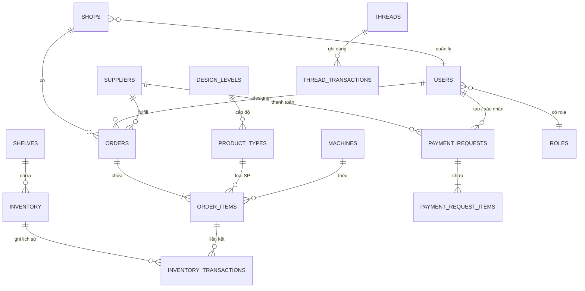

# Thiết kế Cơ sở Dữ liệu

## ERD Tổng quan

---

## Định nghĩa Bảng

### `shops` — Cửa hàng Etsy

| Cột | Kiểu | Mô tả |
|-----|------|-------|
| `id` | INT PK | |
| `name` | VARCHAR(100) | Tên shop |
| `etsy_shop_id` | VARCHAR(50) | ID trên Etsy |
| `etsy_api_key` | VARCHAR(255) | API key (encrypted) |
| `is_active` | TINYINT | 1 = hoạt động |

### `users` — Người dùng hệ thống

| Cột | Kiểu | Mô tả |
|-----|------|-------|
| `id` | INT PK | |
| `name` | VARCHAR(100) | Tên hiển thị |
| `email` | VARCHAR(150) | Email đăng nhập |
| `password_hash` | VARCHAR(255) | Mật khẩu (bcrypt) |
| `role_id` | INT FK → roles | Vai trò |
| `shop_id` | INT FK → shops | Shop phụ trách (nullable) |
| `avatar` | VARCHAR(255) | Đường dẫn ảnh đại diện |
| `is_active` | TINYINT | |
| `created_at` | DATETIME | |

### `roles` — Vai trò phân quyền

| Cột | Kiểu | Mô tả |
|-----|------|-------|
| `id` | INT PK | |
| `name` | VARCHAR(50) | admin, manager, designer, warehouse, production, finance |
| `permissions` | JSON | Danh sách quyền |

### `orders` — Đơn hàng từ Etsy

| Cột | Kiểu | Mô tả |
|-----|------|-------|
| `id` | INT PK | |
| `etsy_order_id` | VARCHAR(50) | ID đơn hàng Etsy |
| `shop_id` | INT FK → shops | |
| `status` | ENUM | new, designing, designed, in_production, produced, out_stock, shipped |
| `designer_id` | INT FK → users | Designer phụ trách |
| `supplier_id` | INT FK → suppliers | Xưởng / NCC fulfill |
| `fulfill_type` | ENUM | internal, external |
| `labels` | VARCHAR(255) | Tag: "Làm gấp", ... |
| `streamer_note` | TEXT | Ghi chú cá nhân hóa từ khách |
| `order_total` | DECIMAL(12,2) | |
| `currency` | VARCHAR(3) | USD / VND |
| `tracking_number` | VARCHAR(100) | |
| `created_at` | DATETIME | Ngày tạo trên Etsy |
| `pushed_at` | DATETIME | Ngày đẩy xưởng |
| `shipped_at` | DATETIME | |

### `order_items` — Dòng sản phẩm trong đơn

| Cột | Kiểu | Mô tả |
|-----|------|-------|
| `id` | INT PK | |
| `order_id` | INT FK → orders | |
| `product_type_id` | INT FK → product_types | |
| `sku` | VARCHAR(50) | Mã SKU |
| `qty` | INT | Số lượng |
| `variants` | JSON | Size, Color, Style, ... |
| `personalization` | TEXT | Nội dung cá nhân hóa |
| `design_file_emb` | VARCHAR(255) | Đường dẫn file EMB |
| `design_file_dst` | VARCHAR(255) | Đường dẫn file DST |
| `design_file_pdf` | VARCHAR(255) | Đường dẫn file PDF |
| `machine_id` | INT FK → machines | Máy thêu phụ trách |
| `production_note` | TEXT | Ghi chú sản xuất |
| `status` | ENUM | pending, in_progress, done |

### `product_types` — Loại sản phẩm

| Cột | Kiểu | Mô tả |
|-----|------|-------|
| `id` | INT PK | |
| `name` | VARCHAR(100) | Baby Banner, Hoodie, Sweatshirt, ... |
| `code` | VARCHAR(20) | Mã nội bộ |
| `design_level_id` | INT FK → design_levels | |
| `default_supplier_id` | INT FK → suppliers | NCC mặc định |
| `is_active` | TINYINT | |

### `design_levels` — Cấp độ thiết kế

| Cột | Kiểu | Mô tả |
|-----|------|-------|
| `id` | INT PK | |
| `name` | VARCHAR(50) | Level 1, Level 2, ... |
| `description` | TEXT | Mô tả độ phức tạp |

### `suppliers` — Nhà cung cấp / Xưởng

| Cột | Kiểu | Mô tả |
|-----|------|-------|
| `id` | INT PK | |
| `name` | VARCHAR(100) | Streamhub, EGfulfill, ... |
| `type` | ENUM | internal, external_fulfill, material |
| `contact_name` | VARCHAR(100) | |
| `contact_phone` | VARCHAR(20) | |
| `bank_account` | VARCHAR(100) | Số tài khoản thanh toán |
| `bank_name` | VARCHAR(100) | |
| `is_active` | TINYINT | |

### `shelves` — Kệ hàng trong kho

| Cột | Kiểu | Mô tả |
|-----|------|-------|
| `id` | INT PK | |
| `name` | VARCHAR(50) | Kệ số 1, Kệ số 2, ... |
| `capacity` | INT | Sức chứa tối đa |
| `current_count` | INT | Số lượng hiện tại |
| `location` | VARCHAR(100) | Vị trí trong kho |

### `inventory` — Tồn kho phôi

| Cột | Kiểu | Mô tả |
|-----|------|-------|
| `id` | INT PK | |
| `product_code` | VARCHAR(50) | Mã QR / mã phôi |
| `sku` | VARCHAR(50) | SKU sản phẩm |
| `product_type_id` | INT FK → product_types | |
| `shelf_id` | INT FK → shelves | Kệ đang để |
| `qty` | INT | Số lượng tồn |
| `unit` | VARCHAR(20) | cái, cuộn, ... |
| `updated_at` | DATETIME | |

### `inventory_transactions` — Lịch sử nhập/xuất kho

| Cột | Kiểu | Mô tả |
|-----|------|-------|
| `id` | INT PK | |
| `inventory_id` | INT FK → inventory | |
| `type` | ENUM | in (nhập), out (xuất) |
| `qty` | INT | |
| `order_item_id` | INT FK → order_items | Nếu xuất cho sản xuất |
| `note` | TEXT | |
| `created_by` | INT FK → users | |
| `created_at` | DATETIME | |

### `threads` — Chỉ thêu

| Cột | Kiểu | Mô tả |
|-----|------|-------|
| `id` | INT PK | |
| `color_code` | VARCHAR(20) | Mã màu (Navy, White, ...) |
| `color_name` | VARCHAR(100) | Tên màu |
| `brand` | VARCHAR(50) | Thương hiệu chỉ |
| `qty` | DECIMAL(10,2) | Số lượng tồn |
| `unit` | VARCHAR(10) | cuộn, mét |
| `min_threshold` | DECIMAL(10,2) | Ngưỡng cảnh báo |

### `machines` — Máy thêu

| Cột | Kiểu | Mô tả |
|-----|------|-------|
| `id` | INT PK | |
| `name` | VARCHAR(100) | Tên máy |
| `model` | VARCHAR(100) | Model máy |
| `status` | ENUM | active, maintenance, idle |
| `heads` | INT | Số đầu thêu |

### `payment_requests` — Đề nghị thanh toán

| Cột | Kiểu | Mô tả |
|-----|------|-------|
| `id` | INT PK | |
| `seri_number` | VARCHAR(20) | Mã số (YYYYMM + seq, VD: 2026060021) |
| `supplier_id` | INT FK → suppliers | |
| `payment_group` | ENUM | external_fulfill, material, thread, other |
| `total_amount` | DECIMAL(14,2) | |
| `currency` | VARCHAR(3) | VND / USD |
| `status` | ENUM | pending, accepted, paid |
| `created_by` | INT FK → users | |
| `confirmed_by` | INT FK → users | |
| `due_date` | DATE | Hạn thanh toán |
| `paid_date` | DATE | |
| `note` | TEXT | |
| `created_at` | DATETIME | |

### `payment_request_items` — Dòng chi tiết đề nghị TT

| Cột | Kiểu | Mô tả |
|-----|------|-------|
| `id` | INT PK | |
| `payment_request_id` | INT FK → payment_requests | |
| `description` | TEXT | Nội dung |
| `qty` | DECIMAL(10,2) | |
| `unit` | VARCHAR(20) | |
| `unit_price` | DECIMAL(14,2) | |
| `total` | DECIMAL(14,2) | |
| `reference_id` | INT | ID order/stock liên quan (nếu có) |

### `documents` — Tài liệu nội bộ

| Cột | Kiểu | Mô tả |
|-----|------|-------|
| `id` | INT PK | |
| `category` | ENUM | system_guide, sales_case, listing_idea, design_doc, qc_doc |
| `title` | VARCHAR(255) | |
| `file_path` | VARCHAR(255) | |
| `uploaded_by` | INT FK → users | |
| `created_at` | DATETIME | |
