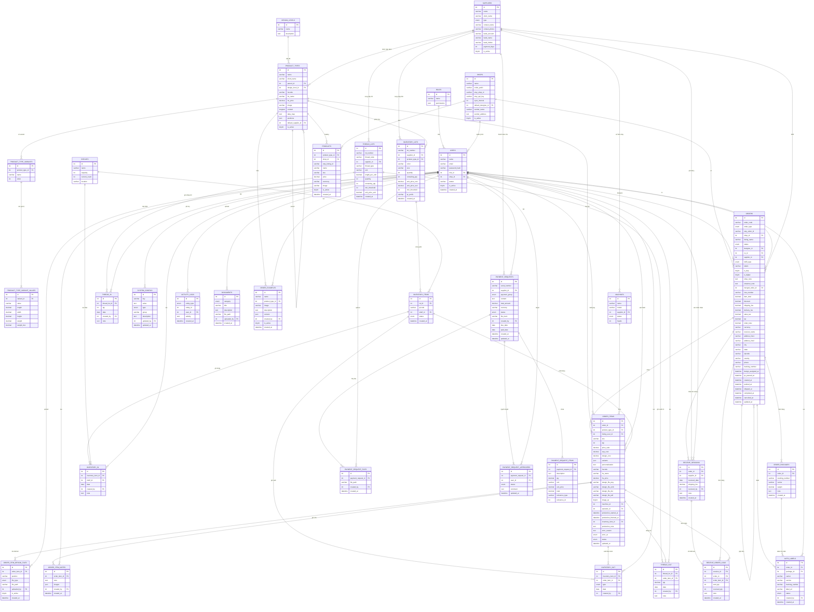

# ERD — Streamhubs Database Schema

```mermaid
erDiagram
    SHOPS {
        int id PK
        varchar name
        varchar order_prefix
        varchar etsy_shop_id
        varchar etsy_api_key
        int sync_interval
        int default_designer_id FK
        varchar sender_name
        text sender_address
        tinyint is_active
    }

    ROLES {
        int id PK
        varchar name
        json permissions
    }

    USERS {
        int id PK
        varchar name
        varchar email
        varchar password_hash
        int role_id FK
        int shop_id FK
        varchar avatar
        tinyint is_active
        datetime created_at
    }

    DESIGN_LEVELS {
        int id PK
        varchar name
        text description
    }

    SUPPLIERS {
        int id PK
        varchar name
        varchar short_name
        enum type
        varchar contact_name
        varchar contact_phone
        varchar bank_account
        varchar bank_name
        varchar bank_holder
        int payment_days
        tinyint is_active
    }

    PRODUCT_TYPES {
        int id PK
        varchar name
        varchar short_name
        int parent_id FK
        int design_level_id FK
        varchar hscode
        varchar hs_name
        decimal hs_price
        varchar image
        longtext content
        text data_map
        json positions
        int default_supplier_id FK
        tinyint is_active
    }

    PRODUCT_TYPE_VARIANTS {
        int id PK
        int product_type_id FK
        varchar name
        int order
    }

    PRODUCT_TYPE_VARIANT_VALUES {
        int id PK
        int variant_id FK
        varchar value
        decimal length
        decimal width
        decimal height
        decimal weight
        decimal weight_box
    }

    MACHINES {
        int id PK
        varchar name
        varchar model
        int supplier_id FK
        enum status
        int heads
    }

    ORDERS {
        int id PK
        varchar order_code
        enum order_type
        varchar etsy_order_id
        int shop_id FK
        varchar listing_name
        enum status
        int designer_id FK
        int cs_id FK
        int supplier_id FK
        enum fulfill_type
        varchar labels
        tinyint is_dup
        tinyint is_digital
        text shop_note
        text streamer_note
        int merged_order_id FK
        varchar ioss_number
        decimal item_total
        decimal discount
        decimal shipping_fee
        decimal delivery_fee
        decimal sales_tax
        decimal tax
        decimal order_total
        varchar currency
        varchar receiver_name
        varchar address_line1
        varchar address_line2
        varchar city
        varchar state
        varchar zipcode
        varchar country
        varchar phone
        varchar tracking_number
        datetime design_assigned_at
        datetime qc_passed_at
        datetime created_at
        datetime pushed_at
        datetime shipped_at
        datetime completed_at
        datetime cancelled_at
        datetime updated_at
    }

    ORDER_ITEMS {
        int id PK
        int order_id FK
        int product_type_id FK
        int listing_user_id FK
        varchar sku
        int qty
        decimal price_sale
        decimal sup_cost
        decimal design_cost
        json variants
        text personalization
        varchar hscode
        varchar hs_name
        decimal hs_price
        varchar design_file_png
        varchar design_file_emb
        varchar design_file_dst
        varchar design_file_pdf
        tinyint image_qc
        int machine_id FK
        int operator_id FK
        datetime production_started_at
        datetime production_finished_at
        int inventory_item_id FK
        text production_note
        text error_reason
        enum error_at
        enum status
        datetime updated_at
    }

    %% order_items.status values: pending, in_progress, done, redo, qc_failed, qc_passed

    ORDER_ITEM_DESIGN_FILES {
        int id PK
        int order_item_id FK
        varchar position
        enum file_type
        varchar file_path
        int uploaded_by FK
        tinyint is_active
        datetime created_at
    }

    ORDER_ITEM_NOTES {
        int id PK
        int order_item_id FK
        text note
        json images
        int created_by FK
        datetime created_at
    }

    ORDER_PACKAGES {
        int id PK
        int order_id FK
        varchar tracking_number
        varchar carrier
        decimal weight
        text note
        datetime created_at
    }

    SHELVES {
        int id PK
        varchar name
        int capacity
        int current_count
        varchar location
    }

    INVENTORY_LOTS {
        int id PK
        varchar lot_number
        int supplier_id FK
        int product_type_id FK
        varchar color
        varchar size
        int quantity
        int remaining_qty
        decimal unit_price_vnd
        decimal unit_price_usd
        int min_threshold
        varchar qr_prefix
        datetime created_at
    }

    INVENTORY_ITEMS {
        int id PK
        int lot_id FK
        varchar qrcode
        int shelf_id FK
        enum status
        datetime created_at
    }

    INVENTORY_IN {
        int id PK
        int inventory_item_id FK
        int shelf_id FK
        date date
        int created_by FK
        text note
    }

    INVENTORY_OUT {
        int id PK
        int inventory_item_id FK
        int order_item_id FK
        enum type
        date date
        int created_by FK
    }

    THREAD_LOTS {
        int id PK
        varchar lot_number
        varchar thread_code
        int supplier_id FK
        varchar thread_type
        varchar unit
        decimal length_per_unit
        int quantity
        int remaining_qty
        int min_threshold
        decimal unit_price_vnd
        datetime created_at
    }

    THREAD_IN {
        int id PK
        int thread_lot_id FK
        int qty
        date date
        int created_by FK
        text note
    }

    THREAD_OUT {
        int id PK
        int thread_lot_id FK
        int order_item_id FK
        decimal qty
        date date
        int created_by FK
        text note
    }

    RECEIVE_SESSIONS {
        int id PK
        int order_id FK
        int supplier_id FK
        date received_date
        decimal shipping_fee
        int received_by FK
        text note
        datetime created_at
    }

    RECEIVE_ORDER_LOGS {
        int id PK
        int session_id FK
        int order_id FK
        int order_item_id FK
        int sent_qty
        int received_qty
        text note
        datetime created_at
    }

    SYSTEM_CONFIGS {
        int id PK
        varchar key
        text value
        enum type
        varchar group
        text description
        int updated_by FK
        datetime updated_at
    }

    PAYMENT_REQUESTS {
        int id PK
        varchar serial_number
        int supplier_id FK
        enum payment_group
        text content
        decimal total_amount
        varchar currency
        enum status
        varchar file_main
        int created_by FK
        date due_date
        date paid_date
        datetime created_at
        datetime updated_at
    }

    PAYMENT_REQUEST_FILES {
        int id PK
        int payment_request_id FK
        varchar file_path
        int created_by FK
        datetime created_at
    }

    PAYMENT_REQUEST_APPROVERS {
        int id PK
        int payment_request_id FK
        int user_id FK
        enum status
        text comment
        datetime updated_at
    }

    PAYMENT_REQUEST_ITEMS {
        int id PK
        int payment_request_id FK
        text description
        decimal qty
        varchar unit
        decimal unit_price
        decimal total
        varchar reference_type
        int reference_id
    }

    ACTIVITY_LOGS {
        int id PK
        enum entity_type
        int entity_id
        int user_id FK
        text activity
        datetime created_at
    }

    DOCUMENTS {
        int id PK
        enum category
        varchar title
        text description
        varchar file_path
        int uploaded_by FK
        datetime created_at
    }

    PRODUCTS {
        int id PK
        int product_type_id FK
        int shop_id FK
        varchar etsy_listing_id
        varchar name
        varchar sku
        decimal price
        varchar currency
        varchar image
        tinyint is_active
        datetime created_at
    }

    ORDER_EXAMPLES {
        int id PK
        varchar name
        int product_type_id FK
        varchar image
        text description
        json content
        int created_by FK
        tinyint is_active
        datetime created_at
    }

    AUTO_LABELS {
        int id PK
        int order_id FK
        int package_id FK
        varchar carrier
        varchar service
        varchar tracking_number
        varchar label_url
        enum status
        int created_by FK
        datetime created_at
    }

    %% Auth & Access
    ROLES ||--o{ USERS : "role"
    SHOPS ||--o{ USERS : "quản lý bởi"

    %% Orders
    SHOPS ||--o{ ORDERS : "có"
    USERS ||--o{ ORDERS : "designer"
    USERS ||--o{ ORDERS : "cs"
    SUPPLIERS ||--o{ ORDERS : "fulfill"
    ORDERS ||--o{ ORDERS : "gộp đơn"
    ORDERS ||--|{ ORDER_ITEMS : "chứa"
    ORDERS ||--o{ ORDER_PACKAGES : "kiện hàng"

    %% Order Item Design Files
    ORDER_ITEMS ||--o{ ORDER_ITEM_DESIGN_FILES : "file thiết kế"
    USERS ||--o{ ORDER_ITEM_DESIGN_FILES : "upload"

    %% Order Item Notes
    ORDER_ITEMS ||--o{ ORDER_ITEM_NOTES : "ghi chú"
    USERS ||--o{ ORDER_ITEM_NOTES : "tạo"

    %% Order Items
    PRODUCT_TYPES ||--o{ ORDER_ITEMS : "loại SP"
    USERS ||--o{ ORDER_ITEMS : "listing by"
    MACHINES ||--o{ ORDER_ITEMS : "thêu"
    USERS ||--o{ ORDER_ITEMS : "vận hành"
    SUPPLIERS ||--o{ MACHINES : "sở hữu máy"

    %% Product Config
    PRODUCT_TYPES ||--o{ PRODUCT_TYPES : "parent"
    DESIGN_LEVELS ||--o{ PRODUCT_TYPES : "cấp độ"
    SUPPLIERS ||--o{ PRODUCT_TYPES : "NCC mặc định"
    PRODUCT_TYPES ||--o{ PRODUCT_TYPE_VARIANTS : "có variant"
    PRODUCT_TYPE_VARIANTS ||--|{ PRODUCT_TYPE_VARIANT_VALUES : "các giá trị"

    %% Inventory
    SUPPLIERS ||--o{ INVENTORY_LOTS : "cung cấp phôi"
    PRODUCT_TYPES ||--o{ INVENTORY_LOTS : "phân loại"
    INVENTORY_LOTS ||--o{ INVENTORY_ITEMS : "chứa phôi"
    SHELVES ||--o{ INVENTORY_ITEMS : "lưu tại kệ"
    INVENTORY_ITEMS ||--o{ INVENTORY_IN : "ghi nhập"
    INVENTORY_ITEMS ||--o{ INVENTORY_OUT : "ghi xuất"
    ORDER_ITEMS ||--o{ INVENTORY_OUT : "xuất theo item"
    INVENTORY_ITEMS ||--o{ ORDER_ITEMS : "phôi dùng"
    SHELVES ||--o{ INVENTORY_IN : "kệ nhận"
    USERS ||--o{ INVENTORY_IN : "tạo"
    USERS ||--o{ INVENTORY_OUT : "tạo"

    %% Thread
    SUPPLIERS ||--o{ THREAD_LOTS : "cung cấp chỉ"
    THREAD_LOTS ||--o{ THREAD_IN : "ghi nhập chỉ"
    THREAD_LOTS ||--o{ THREAD_OUT : "ghi xuất chỉ"
    ORDER_ITEMS ||--o{ THREAD_OUT : "dùng chỉ"
    USERS ||--o{ THREAD_IN : "tạo"
    USERS ||--o{ THREAD_OUT : "tạo"

    %% Nhận hàng từ xưởng
    ORDERS ||--o{ RECEIVE_SESSIONS : "nhận từ xưởng"
    SUPPLIERS ||--o{ RECEIVE_SESSIONS : "gửi hàng"
    USERS ||--o{ RECEIVE_SESSIONS : "xác nhận nhận"
    RECEIVE_SESSIONS ||--|{ RECEIVE_ORDER_LOGS : "chi tiết item"
    ORDERS ||--o{ RECEIVE_ORDER_LOGS : "đơn hàng"
    ORDER_ITEMS ||--o{ RECEIVE_ORDER_LOGS : "item nhận"

    %% System Configs
    USERS ||--o{ SYSTEM_CONFIGS : "cập nhật"

    %% Payment
    SUPPLIERS ||--o{ PAYMENT_REQUESTS : "thanh toán cho"
    USERS ||--o{ PAYMENT_REQUESTS : "tạo"
    PAYMENT_REQUESTS ||--|{ PAYMENT_REQUEST_ITEMS : "chứa"
    PAYMENT_REQUESTS ||--|{ PAYMENT_REQUEST_APPROVERS : "người duyệt"
    USERS ||--o{ PAYMENT_REQUEST_APPROVERS : "duyệt"
    PAYMENT_REQUESTS ||--o{ PAYMENT_REQUEST_FILES : "file phụ"
    USERS ||--o{ PAYMENT_REQUEST_FILES : "upload"

    %% Products & Examples
    PRODUCT_TYPES ||--o{ PRODUCTS : "catalog"
    SHOPS ||--o{ PRODUCTS : "bán"
    PRODUCT_TYPES ||--o{ ORDER_EXAMPLES : "mẫu"
    USERS ||--o{ ORDER_EXAMPLES : "tạo"

    %% Auto Label
    ORDERS ||--o{ AUTO_LABELS : "label"
    ORDER_PACKAGES ||--o{ AUTO_LABELS : "label cho kiện"
    USERS ||--o{ AUTO_LABELS : "tạo"

    %% Logs & Docs
    USERS ||--o{ ACTIVITY_LOGS : "ghi log"
    USERS ||--o{ DOCUMENTS : "upload"
```
