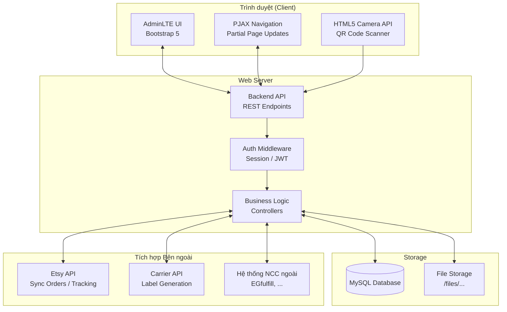

# Kiến trúc Hệ thống

## Mô hình kiến trúc

StreamHub áp dụng kiến trúc **Monolithic** với frontend được tăng tốc bằng PJAX (Partial AJAX), phù hợp với quy mô doanh nghiệp vừa và nhỏ, dễ bảo trì và triển khai.



---

## Tech Stack

| Tầng | Công nghệ | Ghi chú |
|------|-----------|---------|
| **Frontend** | AdminLTE 3.x + Bootstrap 5 | Giao diện admin chuẩn |
| **Navigation** | PJAX (`data-pjax`) | Tải nội dung không reload toàn trang |
| **QR Scanning** | HTML5 `getUserMedia` + QR library | Camera trên trình duyệt, modal scan |
| **Date Picker** | `daterange` input (DateRangePicker) | Lọc theo khoảng thời gian |
| **Select2** | `select2Status` multiple | Dropdown search + multiple select |
| **Charts** | SVG Donut Chart (stream) | Thống kê trạng thái thanh toán |
| **Backend** | PHP / Node.js | Xử lý REST API, business logic |
| **Database** | MySQL | RDBMS chính |
| **File Storage** | Local FS hoặc Object Storage | Lưu ảnh, file thiết kế EMB/DST/PDF |

---

## Tích hợp bên ngoài

### Etsy API
- **Mục đích:** Đồng bộ orders mới về hệ thống, cập nhật tracking khi xuất kho
- **Chiều dữ liệu:** Etsy → StreamHub (orders) và StreamHub → Etsy (tracking)
- **Dữ liệu lấy về:** Order ID, shop, buyer info, line items, personalization note, variants

### Carrier / Vận chuyển
- **Mục đích:** Sinh nhãn vận chuyển tự động (`/auto-label`)
- **Trigger:** Khi order chuyển trạng thái xuất kho

### Nhà cung cấp ngoài (EGfulfill, …)
- **Mục đích:** Gửi lệnh fulfill, nhận tracking
- **Phân loại:** `fulfill_type = external` trong bảng orders

---

## Cấu trúc URL / Routing

```
/orders                  → Order management (main)
/stock/order             → Factory orders
/in-out                  → Inventory input
/output-order            → Inventory output
/inventory               → Inventory report
/by-qrcode               → QC scan
/scan-track              → Tracking scan
/request-payment         → Payment requests
/add-request-payment     → Create payment request
/gen-qrcode              → QR generation
/admin/inventory/input-other   → Other stock input
/history-input           → Input history
/history-print           → Print history
```

---

## Luồng PJAX

Các container PJAX được xác định bằng `data-pjax-container` và `data-pjax`:

- `#id-pjax` — bảng danh sách order (hỗ trợ filter, sort, pagination không reload)
- `#pjax_request_payment` — bảng danh sách đề nghị thanh toán
- `#pjax_request_payment_statis` — thống kê KPI thanh toán
