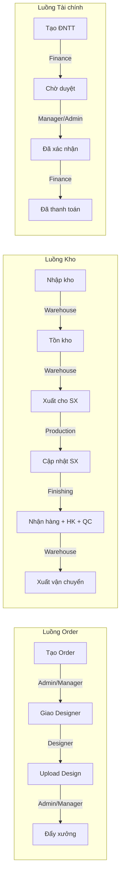

# Phân quyền Người dùng (RBAC)

## Các Vai trò (Roles)

| Role ID | Tên Role | Mô tả |
|---------|----------|-------|
| `admin` | Admin | Quản trị toàn bộ hệ thống |
| `manager` | Manager | Quản lý vận hành, phê duyệt |
| `designer` | Designer | Xử lý thiết kế order |
| `designer_senior` | Designer Senior | Thiết kế + duyệt design của Designer |
| `warehouse` | Warehouse Staff | Quản lý kho, QR, xuất nhập kho |
| `production` | Production Staff | Nhận và cập nhật lệnh sản xuất |
| `finishing` | Finishing Staff | Hậu kì: nhận hàng từ xưởng, hoàn thiện, QC |
| `finance` | Finance / Kế toán | Tạo và duyệt đề nghị thanh toán |

---

## Ma trận Phân quyền

### Module: Orders

| Chức năng | Admin | Manager | Designer Senior | Designer | Warehouse | Production | Finishing | Finance |
|-----------|:-----:|:-------:|:--------------:|:--------:|:---------:|:----------:|:---------:|:-------:|
| Xem danh sách order | ✅ | ✅ | ✅ | ✅ | ✅ | ✅ | ✅ | ✅ |
| Tạo order thủ công | ✅ | ✅ | — | — | — | — | — | — |
| Chỉnh sửa order | ✅ | ✅ | ✅ (đang design) | ✅ (đang design) | — | — | — | — |
| Upload file thiết kế | ✅ | ✅ | ✅ | ✅ | — | — | — | — |
| **Duyệt design** (`pending_review → designed`) | ✅ | ✅ | ✅ | — | — | — | — | — |
| Đẩy xưởng | ✅ | ✅ | — | — | — | — | — | — |
| Hủy order (`cancelled`) | ✅ | ✅ | — | — | — | — | — | — |
| Export CSV | ✅ | ✅ | ✅ | ✅ | ✅ | — | — | — |
| Xóa order | ✅ | — | — | — | — | — | — | — |

### Module: Kho xưởng

| Chức năng | Admin | Manager | Designer | Warehouse | Production | Finishing | Finance |
|-----------|:-----:|:-------:|:--------:|:---------:|:----------:|:---------:|:-------:|
| Nhập kho phôi (`/in-out`) | ✅ | ✅ | — | ✅ | — | — | — |
| Xuất kho (`/output-order`) | ✅ | ✅ | — | ✅ | — | — | — |
| Xem tồn kho | ✅ | ✅ | — | ✅ | ✅ | — | — |
| Quản lý kệ | ✅ | ✅ | — | ✅ | — | — | — |
| Tạo QR Code | ✅ | ✅ | — | ✅ | — | — | — |
| QC quét QR (`/by-qrcode`) | ✅ | — | — | ✅ | — | ✅ | — |
| Nhận hàng từ xưởng (`/receive-order`) | ✅ | ✅ | — | — | — | ✅ | — |
| Hậu kì (`/export-hk`) | ✅ | ✅ | — | — | — | ✅ | — |
| Quét tracking (`/scan-track`) | ✅ | — | — | ✅ | — | — | — |
| Xem lệnh SX | ✅ | ✅ | — | ✅ | ✅ | ✅ | — |
| Cập nhật trạng thái SX | ✅ | ✅ | — | — | ✅ | — | — |
| Quản lý chỉ thêu | ✅ | ✅ | — | ✅ | — | — | — |
| Quản lý máy thêu | ✅ | ✅ | — | — | ✅ | — | — |
| Dashboard supplier | ✅ | ✅ | — | ✅ | ✅ | ✅ | — |

### Module: Đề nghị Thanh toán

| Chức năng | Admin | Manager | Designer | Warehouse | Production | Finishing | Finance |
|-----------|:-----:|:-------:|:--------:|:---------:|:----------:|:---------:|:-------:|
| Tạo đề nghị TT | ✅ | ✅ | — | ✅ | — | — | ✅ |
| Xem danh sách | ✅ | ✅ | — | ✅ | — | — | ✅ |
| Xác nhận (approve) | ✅ | ✅ | — | — | — | — | — |
| Đánh dấu đã thanh toán | ✅ | ✅ | — | — | — | — | ✅ |
| Xóa / hủy | ✅ | — | — | — | — | — | — |

### Module: Sản phẩm & MDM

| Chức năng | Admin | Manager | Designer | Warehouse | Production | Finishing | Finance |
|-----------|:-----:|:-------:|:--------:|:---------:|:----------:|:---------:|:-------:|
| Quản lý loại SP | ✅ | ✅ | — | — | — | — | — |
| Quản lý cấp độ TK | ✅ | ✅ | ✅ | — | — | — | — |
| Quản lý nhà cung cấp | ✅ | ✅ | — | — | — | — | ✅ |
| Xem danh sách SP | ✅ | ✅ | ✅ | ✅ | ✅ | — | — |

### Module: Hệ thống

| Chức năng | Admin | Manager | Designer | Warehouse | Production | Finishing | Finance |
|-----------|:-----:|:-------:|:--------:|:---------:|:----------:|:---------:|:-------:|
| Quản lý người dùng | ✅ | — | — | — | — | — | — |
| Cấu hình hệ thống | ✅ | — | — | — | — | — | — |
| Quản lý shops Etsy | ✅ | ✅ | — | — | — | — | — |
| Xem Documents | ✅ | ✅ | ✅ | ✅ | ✅ | ✅ | ✅ |
| Upload Documents | ✅ | ✅ | ✅ | ✅ | — | — | ✅ |
| Auto Label | ✅ | ✅ | — | ✅ | — | — | — |

---

## Sơ đồ Phân quyền theo Luồng



---

## Cấu trúc Permissions JSON

Ví dụ cấu trúc permissions cho role `finishing`:

```json
{
  "orders": {
    "view": true,
    "create": false,
    "edit": false,
    "delete": false,
    "upload_design": false,
    "push_factory": false,
    "cancel": false,
    "export": false
  },
  "warehouse": {
    "receive_order": true,
    "export_hk": true,
    "qc_scan": true,
    "inventory_in": false,
    "inventory_out": false,
    "shelf": false,
    "gen_qrcode": false,
    "scan_track": false,
    "thread": false,
    "machine": false
  },
  "products": {
    "view": false,
    "manage": false
  },
  "payment": false,
  "admin": false
}
```

Ví dụ cấu trúc permissions cho role `designer`:

```json
{
  "orders": {
    "view": true,
    "create": false,
    "edit": "own",
    "delete": false,
    "upload_design": true,
    "push_factory": false,
    "cancel": false,
    "export": true
  },
  "products": {
    "view": true,
    "manage": false
  },
  "warehouse": false,
  "payment": false,
  "admin": false
}
```
