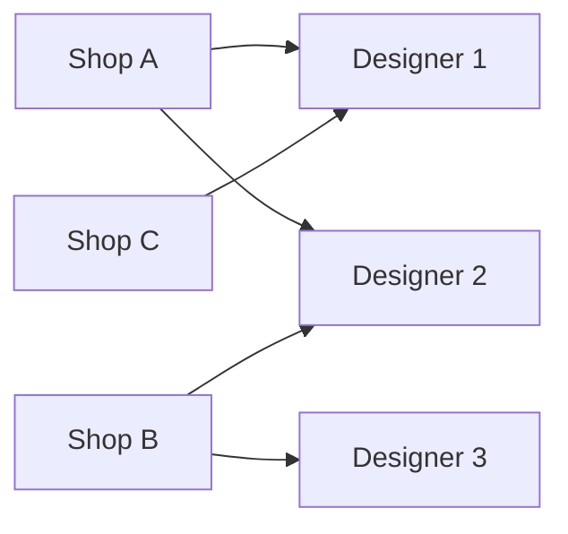

# Dữ liệu Gốc — Người dùng & Shops

## 1. Người dùng (`users`)

### Quy tắc tạo tài khoản

- Email là định danh duy nhất, không được trùng
- Mật khẩu lưu dạng bcrypt hash
- Mỗi user được gán **đúng một** role
- User có thể gắn với một shop Etsy cụ thể (tùy chọn — dùng cho Designer chuyên phụ trách shop)

### Danh sách người dùng cần tạo ban đầu

| Vai trò | Số lượng tối thiểu | Ghi chú |
|---------|:-----------------:|---------|
| Admin | 1 | Tài khoản hệ thống, không dùng hàng ngày |
| Manager | 1–2 | |
| Designer | Theo số nhân sự | Có thể gắn shop |
| Warehouse Staff | 2–3 | |
| Production Staff | Theo số ca máy | |
| Finance | 1–2 | |

---

## 2. Shops Etsy (`shops`)

Mỗi shop Etsy hoạt động như một đơn vị kinh doanh riêng trong hệ thống:

### Thông tin cần thiết lập

| Trường | Mô tả |
|--------|-------|
| `name` | Tên shop (để phân biệt trong filter) |
| `etsy_shop_id` | ID chính thức trên Etsy |
| `etsy_api_key` | OAuth2 access token (cần refresh định kỳ) |
| `sync_interval` | Tần suất đồng bộ order (khuyến nghị: 5–15 phút) |

### Lưu ý tích hợp Etsy API

- Token Etsy OAuth2 hết hạn sau 3,600 giây — cần cơ chế **auto-refresh**
- Etsy API có rate limit: 10 req/giây — cần queue khi sync nhiều shop
- Order được đồng bộ theo `created_timestamp` để tránh bỏ sót

---

## 3. Mapping Designer ↔ Shop

Designer có thể được giao cố định cho một shop hoặc nhận order từ nhiều shop:

> **Khuyến nghị:** Với quy mô nhỏ, không ràng buộc Designer theo shop — manager phân công linh hoạt khi giao order.
