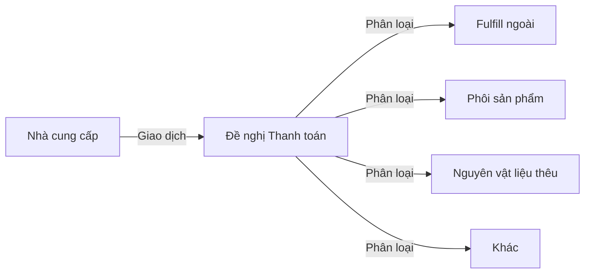

# Dữ liệu Gốc — Nhà cung cấp

## Phân loại Nhà cung cấp

| Loại | `type` | Mô tả |
|------|--------|-------|
| **Xưởng nội bộ** | `internal` | Xưởng Streamhub — SX thêu trực tiếp |
| **Fulfill ngoài** | `external_fulfill` | Đối tác in/fulfill (EGfulfill, ...) |
| **Nguyên vật liệu** | `material` | Cung cấp phôi, chỉ, phụ kiện |

---

## Danh sách Nhà cung cấp Mẫu

| ID | Tên | Loại | Ghi chú |
|----|-----|------|---------|
| 1403 | Xưởng Streamhub | `internal` | Xưởng thêu chính |
| — | EGfulfill | `external_fulfill` | Fulfill đơn hàng ngoài |
| — | Khác | `material` | NCC nguyên vật liệu |

---

## Thông tin cần nhập đủ cho mỗi NCC

| Trường | Bắt buộc | Ghi chú |
|--------|:--------:|---------|
| Tên nhà cung cấp | ✅ | |
| Loại (`type`) | ✅ | |
| Tên người liên hệ | ✅ | |
| Số điện thoại | ✅ | |
| Số tài khoản ngân hàng | ✅ | Cần cho đề nghị thanh toán |
| Tên ngân hàng | ✅ | |
| Địa chỉ | ❌ | Tùy chọn |
| Email | ❌ | |

---

## Lưu ý Vận hành

- **Không xóa** NCC đã có lịch sử giao dịch — chỉ vô hiệu hóa (`is_active = 0`)
- Mỗi loại sản phẩm (`product_types`) có thể liên kết một NCC mặc định
- Đề nghị thanh toán bắt buộc phải chọn NCC — thông tin tài khoản ngân hàng được kéo tự động

---

## Cấu trúc thanh toán

