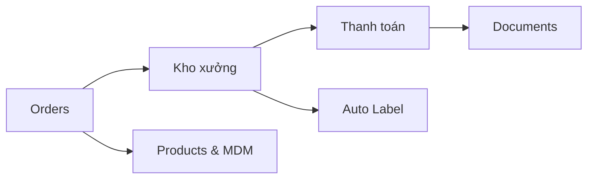

# Phase 5 — Các Module Nghiệp vụ

## Mục tiêu

Đặc tả chi tiết từng module, bao gồm: màn hình chính, luồng tương tác, API endpoints, và các logic nghiệp vụ cốt lõi.

## Thứ tự triển khai (ưu tiên)

| Ưu tiên | Module | File |
|:-------:|--------|------|
| 1 | Orders — Quản lý đơn hàng Etsy | [orders.md](orders.md) |
| 2 | Kho xưởng — Kho, sản xuất, QR | [quan-ly-kho-xuong.md](quan-ly-kho-xuong.md) |
| 3 | Đề nghị Thanh toán | [de-nghi-thanh-toan.md](de-nghi-thanh-toan.md) |
| 4 | Auto Label — Nhãn vận chuyển | [auto-label.md](auto-label.md) |
| 5 | Documents — Tài liệu nội bộ | [documents.md](documents.md) |
