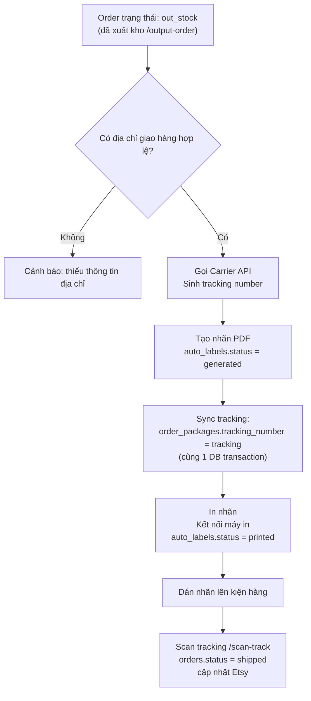

# Module: Auto Label — Tự động In Nhãn Vận chuyển

## Tổng quan

Module tự động sinh và in nhãn vận chuyển (shipping label / tracking label) khi order sẵn sàng xuất kho, kết nối với carrier API.

> **Trạng thái:** Planned feature — chưa có UI mẫu trong `docs/mockups/Auto label/`.

## Luồng Hoạt động

## Chức năng dự kiến

### 1. Tạo nhãn tự động (Bulk)

- Chọn danh sách order cần in nhãn (filter theo trạng thái, shop, ngày)
- Hệ thống gọi carrier API để lấy tracking number cho từng order
- Sinh file PDF nhãn
- In hàng loạt qua máy in nhãn

### 2. Tạo nhãn đơn lẻ

- Từ trang chi tiết order: click "Tạo nhãn"
- Chọn carrier (nếu nhiều carrier)
- Xác nhận và in

### 3. Lịch sử nhãn

- Xem lại các nhãn đã tạo
- Reprint nhãn
- Void nhãn (hủy tracking)

---

## Thông tin Nhãn Vận chuyển

| Thông tin | Nguồn dữ liệu |
|-----------|---------------|
| Tên người nhận | `orders.receiver_name` |
| Địa chỉ giao | `orders.address_line1`, `orders.address_line2`, `orders.city`, `orders.state`, `orders.zipcode` |
| Quốc gia | `orders.country` |
| Số điện thoại | `orders.phone` |
| Tên shop (người gửi) | `shops.sender_name` |
| Địa chỉ gửi | `shops.sender_address` |
| Nội dung hàng hóa | `product_types.name` |
| Tracking number | Trả về từ Carrier API |

---

## Tích hợp Carrier

| Carrier | Phạm vi | Ghi chú |
|---------|---------|---------|
| USPS | Hoa Kỳ | |
| UPS | Quốc tế | |
| FedEx | Quốc tế | |
| (khác) | Tùy từng thị trường | |

> **Cần xác nhận:** Carrier nào đang được sử dụng thực tế.

---

## API Endpoints (dự kiến)

| Method | URL | Mô tả |
|--------|-----|-------|
| `POST` | `/auto-label/create` | Tạo nhãn cho 1 order |
| `POST` | `/auto-label/bulk` | Tạo nhãn hàng loạt |
| `GET` | `/auto-label/{id}/pdf` | Tải file nhãn PDF |
| `DELETE` | `/auto-label/{id}` | Void nhãn |
| `GET` | `/auto-label/history` | Lịch sử in nhãn |
