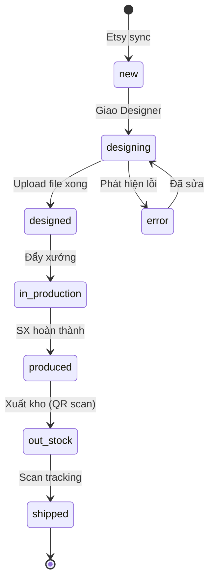

# Module: Orders — Quản lý Đơn hàng

## Tổng quan

Module Orders là trung tâm của hệ thống, nơi quản lý toàn bộ vòng đời đơn hàng từ khi nhận từ Etsy đến khi shipped. Tổng volume: ~99,845 orders, ~117,463 items.

## Màn hình chính

### 1. Danh sách Orders (`/orders`)

**Chức năng lọc:**

| Filter | Kiểu | Mô tả |
|--------|------|-------|
| Etsy Order ID | Text | Tìm chính xác theo ID |
| Date | DateRange | Khoảng thời gian tạo order |
| Order Status | Select | Trạng thái hiện tại |
| Shop | Select | Lọc theo shop Etsy |
| Designer | Select | Designer đang xử lý |
| Product Type | Select | Loại sản phẩm |
| Supplier | Select | Xưởng / NCC fulfill |
| Fulfill Type | Select | internal / external |
| Labels | Checkbox | "Làm gấp", ... |
| Title / Streamer Note | Text | Tìm theo nội dung |

**Query params mẫu:**
```
GET /orders?etsyOrderId=&start=&end=&status=&shop=&designer=
    &product_type=&supplier_id=&fulfill_type=&labels=
    &title=&streamer_note=&limit=50&sort=time_desc&page=1
```

**Thanh trạng thái nhanh (status tabs):**

Hiển thị số lượng theo từng trạng thái để lọc nhanh:
- Mới (387) · Đang Design (539) · Đã Design · Chưa SX · Sản xuất xong · Đã xuất kho · Shipped

**Cột bảng:**

| Cột | Mô tả |
|-----|-------|
| Checkbox | Chọn nhiều để bulk action |
| Order ID | Link đến chi tiết, kèm Etsy Order ID |
| Status | Badge trạng thái, click để đổi trạng thái |
| Listing | Ảnh thumbnail + tên sản phẩm |
| QTY | Số lượng |
| Order Total | Tổng tiền (USD) |

**Cảnh báo nổi bật:**
- `N order quá 2 ngày chưa Design` — màu đỏ
- `N order quá 3 ngày chưa Sản xuất xong` — màu đỏ

---

### 2. Chi tiết Order (`/orders/{id}`)

Hiển thị đầy đủ thông tin:
- Thông tin khách hàng (tên, địa chỉ, quốc gia)
- Danh sách items: variants, personalization, QTY
- File thiết kế đính kèm: EMB / DST / PDF (download/preview)
- Timeline trạng thái
- Ghi chú Designer, ghi chú sản xuất
- Lịch sử thao tác

---

### 3. Tạo Order thủ công (`/orders/create`)

Dùng khi cần tạo order không qua Etsy (đơn lẻ, test, ...):
- Chọn shop, nhập thông tin khách
- Thêm items: chọn product type, nhập variants + personalization
- Chọn fulfill type và NCC

---

### 4. Order Mẫu (`/order-example`)

Màn hình xem mẫu format order để training nhân viên mới.

---

## API Endpoints

| Method | URL | Mô tả |
|--------|-----|-------|
| `GET` | `/orders` | Danh sách có filter + paging |
| `GET` | `/orders/{id}` | Chi tiết order |
| `POST` | `/orders` | Tạo order thủ công |
| `PUT` | `/orders/{id}/status` | Đổi trạng thái |
| `POST` | `/orders/{id}/design` | Upload file thiết kế |
| `POST` | `/orders/{id}/push-factory` | Đẩy sang xưởng |
| `GET` | `/orders/export-csv` | Xuất CSV |

---

## Logic Nghiệp vụ

### Chuyển trạng thái



### Rules

- Chỉ order ở trạng thái `new` mới được giao Designer
- Chỉ upload file thiết kế khi đang ở `designing`
- Đẩy xưởng chỉ khi đủ cả 3 file: EMB + DST + PDF (hoặc theo cấu hình loại SP)
- External fulfill: skip các bước kho và SX
- Đơn lỗi (`/errors`): order bị tách ra theo dõi riêng, không ảnh hưởng count chính
