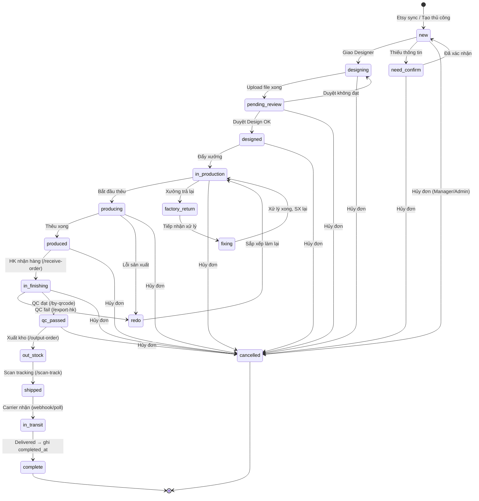

# Module: Orders — Quản lý Đơn hàng

## Tổng quan

Module Orders là trung tâm của hệ thống, nơi quản lý toàn bộ vòng đời đơn hàng từ khi nhận đến khi shipped. Tổng volume: ~99,859 orders, ~117,507 items.

---

## Hai loại Đơn hàng

| Loại | `order_type` | Nguồn | Ghi chú |
|------|-------------|-------|---------|
| **Đơn Etsy** | `etsy` | Đồng bộ tự động từ Etsy API | Có Etsy Order ID, theo dõi tracking trên Etsy |
| **Đơn nội bộ** | `internal` | Tạo thủ công trong hệ thống | Không có Etsy Order ID, dùng cho đơn B2B / nội bộ / test |

Nút **Create Order** trên danh sách có dropdown chọn loại:
- `Đơn Etsy` — tạo và liên kết với Etsy
- `Đơn nội bộ` — tạo thuần nội bộ, không đồng bộ Etsy

---

## Màn hình chính

### 1. Danh sách Orders (`/orders`)

**Cảnh báo nổi bật (5 loại):**

| Cảnh báo | Ngưỡng |
|----------|--------|
| N order quá **2 ngày** chưa Design | Đỏ |
| N order quá **3 ngày** chưa Sản xuất xong | Đỏ |
| N order quá **4 ngày** chưa Ship | Đỏ |
| N order Qc đạt quá **24 tiếng** chưa ship | Đỏ |
| N order Qc đạt quá **5 ngày** chưa InTransit | Đỏ |

**Chức năng lọc:**

| Filter | Kiểu | Mô tả |
|--------|------|-------|
| Etsy Order ID | Text | Tìm chính xác theo ID |
| Date | DateRange | Khoảng thời gian tạo order |
| Order Status | Select | Trạng thái hiện tại |
| Shop | Select | Lọc theo shop Etsy |
| Designer | Select | Designer đang xử lý |
| Loại sản phẩm | Select | `Tất cả` mặc định |
| Xưởng | Select | `Tất cả` mặc định |
| Fulfillment | Select | `Tất cả` mặc định |
| Tags | Select | Nhãn gắn vào order |
| Keyword | Text | SKU, Keyword, Tracking |
| Streamer note | Text | Tìm theo ghi chú khách |
| Fail SKU | Checkbox | Lọc đơn có SKU lỗi |
| Đơn Dup | Checkbox | Đơn trùng |
| Đơn Digital | Checkbox | Sản phẩm digital |
| Đơn Vật lý | Checkbox | Sản phẩm vật lý |
| Not Cancel | Checkbox | Loại trừ đơn đã hủy |
| Ship nhanh | Checkbox | Đơn ưu tiên ship nhanh |

**Thanh trạng thái nhanh (status tabs):**

| Tab UI | `status` | Màu badge |
|--------|---------|-----------|
| Mới | `new` | Xám |
| Need Confirm | `need_confirm` | Cam nhạt |
| Đang Design | `designing` | Xanh dương nhạt |
| Chờ Duyệt Design | `pending_review` | Vàng |
| Đã duyệt design | `designed` | Xanh dương |
| Chưa sản xuất | `in_production` | Vàng đậm |
| Đang Sản Xuất | `producing` | Cam |
| Làm lại | `redo` | Đỏ |
| Xưởng trả lại | `factory_return` | Đỏ đậm |
| Sửa lại | `fixing` | Cam nhạt |
| Đang hậu kỳ | `in_finishing` | Tím nhạt |
| QC đạt | `qc_passed` | Xanh lục nhạt |
| Đã xuất kho | `out_stock` | Xanh lam |
| Shipped | `shipped` | Xanh lá |
| Complete | `complete` | Xanh lá đậm |
| Đã hủy | `cancelled` | Xám đậm (ẩn theo mặc định, hiện khi bỏ filter "Not Cancel") |

**Cột bảng:**

| Cột | Mô tả |
|-----|-------|
| Checkbox | Chọn nhiều để bulk action |
| Order ID | Link mở Order Detail panel (`order_code`) + icon copy + icon edit + icon chat + icon comment. Dưới Order ID có thể có nhãn phụ: **"Đã có label"** (khi `auto_labels.status = generated/printed`), **"Làm gấp"** (khi `labels LIKE '%lam_gap%'`) |
| Status | Badge trạng thái, click dropdown đổi trực tiếp |
| Listing | Ảnh thumbnail + tên sản phẩm + icon nhãn xanh |
| QTY | Số lượng (màu cam nếu > 1) |
| Fulfill | Tên xưởng/NCC fulfill |
| Order Total | Tổng tiền (USD) |
| Base Cost | Chi phí gốc (sup_cost tổng) |
| Shipping Fee | Phí vận chuyển thu từ khách |
| Customer | Tên người mua + Quốc gia (`receiver_name` + `country`) |
| Shop | Tên shop Etsy |
| Ngày thêm | Thời gian tạo (`created_at`) |

---

### 2. Chi tiết Order (`/orders/{id}`)

Màn hình chia làm **2 cột**: cột trái chứa danh sách items, cột phải là sidebar thông tin phụ.

#### Header

| Phần | Nội dung |
|------|----------|
| Góc trái | `order_code` (VD: ME20260604144945) + icon sync Etsy, dòng dưới: timestamp tạo, badge trạng thái (dropdown đổi nhanh) |
| Dưới header | **Shop's Note** (màu xanh lá) — lấy từ `orders.shop_note` (VD: "đơn VN") |
| Giữa | **Tổng số lượng** (đỏ nếu > 1) |
| Góc phải | Nút **Push Fulfill** (dropdown xanh) + nút **Ship HPW** (vàng) |

> **Ship HPW**: Tạo và push tracking lên Etsy theo quy trình nội bộ HPW (Happy Parcel Way — dịch vụ ship nhanh tích hợp). Khác với `/auto-label` (tạo label carrier bên ngoài), Ship HPW xử lý toàn bộ flow trong hệ thống.

#### Cột trái — Danh sách Items

Mỗi item hiển thị:

| Trường | Ghi chú |
|--------|---------|
| Ảnh sản phẩm | Thumbnail, click để xem lớn |
| ID item | Dạng `{order_id}-{item_id}`, màu đỏ |
| Tên sản phẩm | Tên listing đầy đủ |
| Listing by | Tên nhân viên phụ trách + icon Etsy |
| CS | Tên CS phụ trách (có thể trống) |
| SKU | Link màu xanh + icon sync |
| Sup Cost | Chi phí nguyên liệu từ NCC |
| Design Cost | Chi phí thiết kế |
| QTY | Số lượng |
| Price sale | Giá bán (USD) |
| Variant đã chọn | Các giá trị variant (VD: Tote Bag / Green) — sau khi Set variants |
| **Trước** | File thiết kế mặt trước: [EMB] [DST] [PDF] [JPG] — từ `order_item_design_files WHERE position='Trước'` |
| **Mặt sau** | File thiết kế mặt sau: [EMB] [DST] [PDF] [JPG] — từ `order_item_design_files WHERE position='Mặt sau'` |
| Designer | Tên designer phụ trách + user ID trong ngoặc |
| Hscode | `{hscode} - Name: {hs_name} - Price: {hs_price}` |
| Ghi chú đỏ | Cảnh báo nghiệp vụ (VD: "Tất cả sản phẩm thêu trước khi đẩy phải chọn variant và set vị trí thêu") |
| **Item Note** | Accordion — hiển thị các `order_item_notes` kèm ảnh đính kèm |

**Nút hành động trên từng item:**

| Nút | Chức năng |
|-----|-----------|
| PNG | Upload / xem file PNG tổng quan thiết kế |
| Set variants | Gán biến thể sản phẩm + vị trí thêu |
| [Tên Designer] dropdown | Chỉ định hoặc đổi Designer xử lý item |
| [Tên Xưởng] dropdown | Chỉ định xưởng sản xuất cho item |
| [Trạng thái] dropdown | Đổi trạng thái `order_items.status` |
| Icon edit (bút) | Sửa thông tin chi tiết item |
| Icon copy | Nhân bản item |
| Icon X | Xóa item khỏi order |
| Checkbox | Chọn item để bulk action |

#### Cột phải — Sidebar (5 section thu gọn)

**1. Shipping Address**

Các trường: Receiver, Line 1, Line 2, City, State, Zipcode, Country, Phone.
Nút **Update Address** (xanh) để lưu thay đổi địa chỉ.

**2. Order Total**

| Dòng | Ý nghĩa |
|------|---------|
| Item Total | Tổng giá niêm yết các item |
| Discount | Giảm giá Etsy |
| Subtotal | Item Total − Discount |
| Shipping | Phí ship thu từ khách |
| Delivery Fee | Phí giao nội địa (thường $0) |
| Sales Tax | Thuế bang Mỹ |
| Tax | Các loại thuế khác |
| **Order Total** | Tổng thực nhận |

**3. Package**

Nút **+ Add Package**: tạo gói hàng (kiện) cho order.

**4. Extra**

| Nút | Chức năng |
|-----|-----------|
| + Add IOSS | Thêm mã IOSS (thuế nhập khẩu EU) |
| ✓ Image QC | Đánh dấu đã QC ảnh thiết kế |
| ✓ Gộp đơn | Gộp nhiều order vào cùng 1 gói ship |
| Open design {item_id} | Mở file thiết kế của item trong tab mới |

**5. Logs**

Lịch sử thao tác trên order (ai, làm gì, lúc nào).

#### Nút "+ Dup Order"

Nằm trên cùng sidebar — nhân bản toàn bộ order (dùng khi cần tạo đơn tương tự).

---

### 3. Tạo Order (`/orders/create`)

Dropdown **Create Order** có 2 luồng:

**Đơn Etsy:**
- Nhập Etsy Order ID để liên kết
- Đồng bộ thông tin khách từ Etsy API
- Tracking sẽ được cập nhật ngược lên Etsy khi ship

**Đơn nội bộ:**
- Nhập thủ công: thông tin khách, địa chỉ
- Thêm items: chọn product type, nhập variants + personalization
- Chọn fulfill type và NCC
- Không đồng bộ Etsy

---

### 4. `/order-example`

Alias của trang Order List — hiển thị giao diện và chức năng giống hệt `/orders`. Có thể dùng để xem order của shop cụ thể mà không ảnh hưởng filter mặc định của `/orders`.

---

## API Endpoints

| Method | URL | Mô tả |
|--------|-----|-------|
| `GET` | `/orders` | Danh sách có filter + paging |
| `GET` | `/orders/{id}` | Chi tiết order |
| `POST` | `/orders/etsy` | Tạo đơn Etsy thủ công |
| `POST` | `/orders/internal` | Tạo đơn nội bộ |
| `PUT` | `/orders/{id}/status` | Đổi trạng thái |
| `PUT` | `/orders/{id}/cancel` | Hủy đơn (Manager/Admin) — tự động hoàn kho nếu cần |
| `POST` | `/orders/{id}/design` | Upload file thiết kế |
| `POST` | `/orders/{id}/push-factory` | Đẩy sang xưởng |
| `GET` | `/orders/export-csv` | Xuất CSV |

---

## Logic Nghiệp vụ

### Trạng thái đầy đủ

### Rules

- Đơn Etsy: `etsy_order_id` bắt buộc; tracking được push ngược lên Etsy khi ship
- Đơn nội bộ: `etsy_order_id` = NULL; không đồng bộ Etsy
- Chỉ upload file thiết kế khi đang ở `designing`
- Đẩy xưởng chỉ khi status = `designed` (đã được duyệt)
- External fulfill: skip các bước kho và SX nội bộ
- **Chờ Duyệt Design** (`pending_review`): Designer Senior hoặc Manager duyệt
- **Hủy đơn (`cancelled`)**: chỉ Manager/Admin được hủy; có thể hủy khi status `IN (new, need_confirm, designing, pending_review, designed, in_production, producing, redo, fixing, factory_return, produced, in_finishing, qc_passed)`; không hủy khi đã `out_stock` trở đi (hàng đã bàn giao carrier); khi hủy phải hoàn kho nếu đã xuất phôi — set `inventory_items.status = return_error` và ghi `inventory_out.type = return_error`; ghi `cancelled_at = NOW()`
- **Tracking sync**: khi auto_label `status = generated` → phải ghi `order_packages.tracking_number` trong cùng transaction trước khi trả về response

### Sync giữa `orders.status` và `order_items.status`

### Sync giữa `orders.status` và `order_items.status`

`order_items.status` có 4 giá trị (`pending → in_progress → done` / `redo`), còn `orders.status` phản ánh trạng thái tổng. Rule sync:

| Điều kiện `order_items` | `orders.status` chuyển sang | Trigger |
|---|---|---|
| Tất cả items = `pending`, đơn vừa đẩy xưởng | `in_production` | Manager click "Đẩy xưởng" |
| Ít nhất 1 item = `in_progress` | `producing` | Production Staff cập nhật item |
| Tất cả items = `done` | `produced` | Production Staff cập nhật item cuối |
| Bất kỳ item set `redo` | `orders.status = redo` | Production Staff set thủ công |
| Xưởng trả về | `factory_return` → `fixing` | Warehouse/Manager set thủ công |
| Submit form `/receive-order` (`receive_order_logs`) | `in_finishing` | Finishing Staff |
| QC đạt: tất cả item → `qc_passed` tại `/by-qrcode` | `qc_passed` | Finishing Staff quét QR |
| QC fail một item tại `/by-qrcode` | `order_items.status = qc_failed` | Hệ thống — cần xử lý trước khi xuất kho |
| Kho xác nhận xuất kho (`/output-order`) | `out_stock` | Warehouse Staff |
| Carrier scan nhận (webhook/poll) | `in_transit` | Tự động |
| Carrier xác nhận Delivered | `complete`, ghi `completed_at` | Tự động hoặc Manager |

> `orders.status` là trạng thái hiển thị cho toàn order; `order_items.status` dùng cho tracking sản xuất từng dòng (`pending → in_progress → done → qc_passed`) và tính AVG Time trên dashboard.
